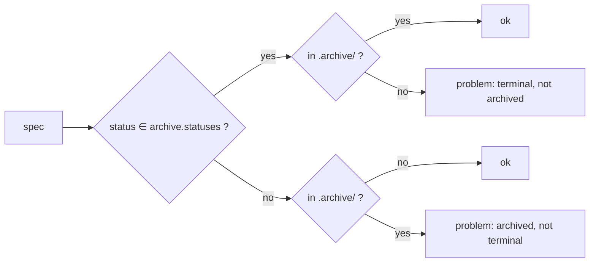

# Lint the archive, and fail a terminal spec that never moved into it

## The problem

Every Latere spec tree retires finished specs into `specs/.archive/`, keeping
the number so `depends_on` still resolves. `speclint` cannot see any of it.

`Load` globs `dir/*.md`. A subdirectory is never read, and `CheckIndex`
skips any row whose link contains a `/` with the comment that such a row
"is pointing outside the linted set". So the archive is outside every rule
the gate holds: frontmatter, vocabulary, index membership, numbering.

Two failures follow, and both are live in the fleet today.

**Terminal specs sit at the root.** Nothing checks placement, so a spec that
finished stays beside the specs still being built. A reader opening
`specs/` cannot tell the live design from the record of what shipped, which
is the distinction the directory split exists to make.

**The archive's own statuses drift into free text.** Because the vocabulary
rule never reaches them, archived specs carry whatever was typed. Measured
across the fleet on 2026-09-01:

| Tree | Distinct statuses in `.archive/` |
|---|---|
| agents | 2 |
| auth | 8 |
| drive | 2 |
| lectio | 2 |
| lux | 15 |
| sandbox | 13 |
| topos | 1 |

lux holds `archived (superseded by 034-refocus-model-gateway; sandbox/agent
surface removed from Lux)` as a status value. sandbox holds two files with no
frontmatter at all. Neither is a status a tool can read, and neither would
have survived a day at the root of the same tree.

This is [[001-gate-principles]] D4 again, one directory down: the gate
measured nothing there and called it green.

## The rule

Two checks, configured together and separable in what they assert.

**Placement.** A spec at a terminal status belongs in the archive; a spec at
any other status belongs at the root. Both directions, because the pair is
only exhaustive that way: the first half catches the spec nobody moved, the
second catches the spec moved before its work was over.



**Coverage.** Archived specs are parsed and their status is closed against
the same vocabulary the root uses, so the drift above cannot recur. They are
not held to the rules that describe work in progress. An archived spec is a
record, and a record written before a rule existed cannot be made to satisfy
it without rewriting history.

The checks archived specs are held to:

| Check | Archived specs | Why |
|---|---|---|
| frontmatter parses | yes | an unparseable record is not a record |
| `require` keys present | yes | the same keys the root needs to be citable |
| status in `spec.status` | yes | this is the drift the rule exists to stop |
| status in `archive.statuses` | yes | placement, above |
| listed in the index | if the index lists any | see *Index labels* |
| index row status matches | **no** | see *Index labels* |
| number is unique tree-wide | yes | the number is what citations resolve through |
| `depends_on` resolves | yes | including edges into the archive |
| sections, markers, registers, scoped ids | no | rules about work in progress |

## Configuration

```yaml
spec:
  archive:
    dir: .archive
    statuses: [complete, superseded, abandoned]
```

`dir` is relative to `spec.dir`, and empty disables both checks. A tree with
no archive yet adopts nothing, the way an empty `index` disables the index
rules.

A configured `dir` that does not exist is the empty archive, not an error.
git cannot track an empty directory, so requiring one would make adoption
wait on inventing a file to put in it. The forward half of the rule still
holds without it: a terminal spec at the root is reported and told where it
belongs, so a tree cannot adopt the rule and have it assert nothing.

`statuses` must be a non-empty subset of `spec.status`. `validate` rejects a
terminal status the vocabulary does not list, for the reason it already
rejects one in `started`/`settled`: a status no spec can hold matches
nothing, so the rule would cover less than it appears to. This is what makes
each tree declare its own terminal set rather than inherit a guess. A tree
where `implemented` means "shipped, follow-on work outstanding" does not list
it; a tree where it means "done" does.

## Index labels

Index rows for archived specs are checked for membership and resolution, not
for their status cell.

An index writes the archive row as a location: auth's table says
`archived (superseded)` where the spec's frontmatter says `superseded`. The
row is telling a reader where the spec went, which is a different claim from
what the frontmatter says about it. A linter that compared the two would
force every tree onto one label vocabulary and catch no error, so it checks
the claim it can check: the row points at a file that exists.

Whether the index covers the archive at all is the tree's decision, and the
index states it by what it holds. auth's says it "lists **every** spec —
active and archived — in one number space"; agents' is a view of where the
platform is now and names retired specs only in prose. Both are defensible,
so the rule is read off the table rather than configured: an index holding at
least one archive row is an index of the whole tree and must hold them all,
because otherwise a reader cannot tell a retired spec from one that was never
written down. An index holding none is an index of the live work and is asked
for nothing.

## Acceptance

1. A tree with a root spec at a terminal status fails, naming the spec and
   the directory it belongs in.
2. A tree with an archived spec at a non-terminal status fails.
3. An archived spec missing a required frontmatter key, or carrying a status
   outside the vocabulary, fails.
10. An archived spec absent from an index that lists other archived specs
    fails; an index that lists none is asked for nothing.
4. An unparseable archived spec is reported as a problem rather than
   aborting the run, so one bad file does not hide the rest of the report.
5. `archive.statuses` naming a status outside `spec.status` is rejected by
   `config.Load`, before any gate reads it.
6. A `depends_on` edge written as `specs/.archive/NNN-name.md` or
   `.archive/NNN-name.md` resolves against the archive, and one naming a file
   that is not there fails. An edge into another repository's archive
   (`../../other/specs/.archive/NNN-name.md`) is left alone: matching the
   last directory alone would read it as this tree's and report a file that
   is not missing.
7. Two specs sharing a number across the boundary fail when `numbered` is on.
8. A tree with no `archive.dir` behaves exactly as it does today.
9. A configured `archive.dir` that does not exist yet passes, and a terminal
   spec at the root still fails against it.
