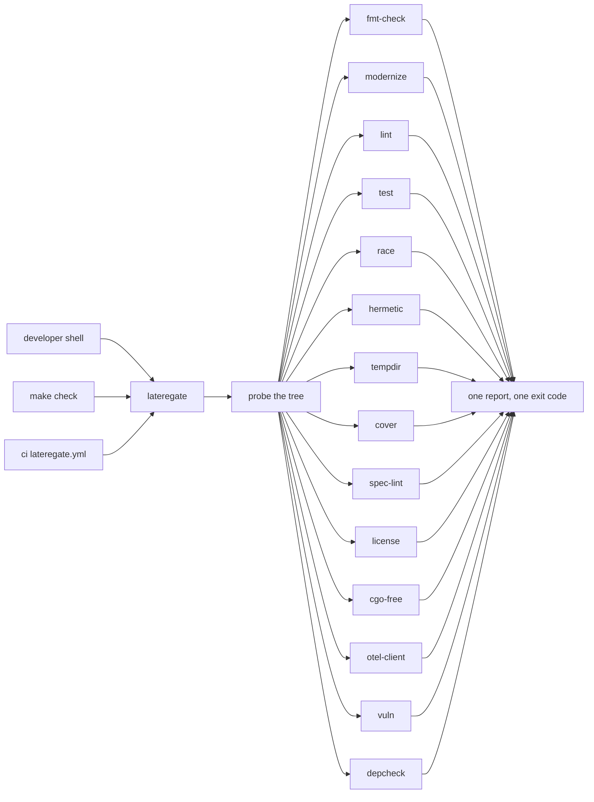

# The binary is the whole bar

## The problem

[[006-gate-set-contract]] declared a required set of make targets and a
`contract` subcommand to check a repository holds them. Measured again
today, across 22 repositories:

| Shape of drift | Count |
|---|---|
| Distinct `cover` recipes for the same gate | 4 (three repository averages, one exits 0 on an empty profile) |
| Distinct `test-race` recipes | 5 (timeouts of 300s, 45m, none; with and without `CGO_ENABLED=1`) |
| Distinct `lint` recipes | 4 (`go run` pinned in make, a system binary with a version check, an action in CI only) |
| Repositories whose `.lateregate.yaml` restates `modernize.disable: [newexpr, errorsastype]` | 20 of 20 that have one |
| Repositories running `contract` | 1 (this one) |
| Waivers dated 2026-12-01 | 9 of 9 |

Every make target is a place a recipe can drift, and every config key with a
sensible default is a line twenty repositories copy. The contract of 006
asked whether a target *exists*, so a repository-average `cover` passed it,
and a target nobody runs in CI passed it too.

The organisation has one bar. The tool that holds it should be the one
thing a repository runs.

## The decision

`lateregate` with no arguments runs every gate in the set against the
repository it is in. A make target, a workflow step and a developer's shell
all invoke the same thing, and there is nothing per repository to write for
the gates themselves.



Three consequences follow, each of which is a section below.

### D1 — Every gate has a recipe, and the binary owns it

The gates 006 left to the Makefile move into the binary:

| Gate | Recipe the binary runs |
|---|---|
| `test` | `go vet ./...` then `go test ./...` |
| `race` | `CGO_ENABLED=1 go test -race ./...` |
| `lint` | render the shared `.golangci.yml`, then `go run github.com/golangci/golangci-lint/v2/cmd/golangci-lint@<pinned> run ./...` |
| `cover` | `go test ./... -covermode=atomic -coverpkg=./... -coverprofile=coverage.out`, then the per-package floor |
| `vuln` | `go run golang.org/x/vuln/cmd/govulncheck@<pinned> ./...` |

The two pins live in this repository as constants. The pipeline's
`golangci_version` input and every `GOLANGCI_VERSION ?=` in a Makefile go
away with them: one version, in one place, moved by one commit.

`cover` keeps `-profile` for a repository whose coverage is split across
tiers it runs itself. Without the flag it collects the profile, so the
default is the whole suite and not whichever file was lying around.

### D2 — The set is decided by probing, not by configuring

A gate applies unless the tree has no subject for it, and the tree is asked
directly:

| Gate | Applies when |
|---|---|
| `spec-lint` | git tracks files under `specs/` |
| `depcheck` | `depcheck.packages` names a package (a promise about a specific package cannot be inferred) |
| every other gate | always |

`license` applies always. It needs `license.spdx`, which has no default by
[[004-license-headers]], so a repository that has not declared its licence
fails the gate with that message. That is the bar raised, not a gap: a
repository that has not decided its licence has not decided it.

A waiver is the only way a gate that applies does not run:

```yaml
waive:
  cover:
    reason: the tree is at 82.2% and the gap is in handler and runner
    until: 2026-11-15
```

The map moves from `contract.exempt` to a top-level `waive`, because it now
governs the run rather than a check of the Makefile. Keys are gate names.
An unknown key fails the load, and an expired waiver makes the gate run and
fail on its own terms rather than as an expiry: the reason for the work is
then in the gate's own output.

### D3 — A default is a decision made once

Every consumer restated the same values. They become defaults:

| Key | Default |
|---|---|
| `modernize.disable` | `[newexpr, errorsastype]`: both fixers emit code that does not compile or half-applies, and they re-propose on every run |
| `spec.dir` | `specs` |
| `spec.require` | `[title, status]` |
| `spec.index` | `specs/README.md` when the file exists |
| `golangci.sloglint` | `context: scope`, every package: where a context is in hand, the `*Context` variant is right regardless of whether the package serves requests |

A key that restates its default is drift waiting to happen, and
[[009-contract-reports-drift]] reports it.

What stays per repository is a decision with a reason: a coverage exemption,
a spec vocabulary, a hermetic allowance, a dependency allowlist, a licence.
That is D2 of [[001-gate-principles]] unchanged.

## The subcommands

```
lateregate              run every applicable gate, report all, exit non-zero on any failure
lateregate check        the same, by name
lateregate list [-json] print each gate with run / skip / waived and the reason
lateregate <gate>       run one gate, for a CI job or a developer chasing one failure
```

`check` does not stop at the first failure. A repository behind on four
gates learns that in one run. Each gate's own output streams as it runs
under a `== <gate>` header, and the summary is last, because it is the
part a reader scrolls to:

```
PASS fmt-check
PASS modernize
FAIL cover        3 package(s) below 90%
SKIP spec-lint    tracks no specs/ files
WAIV race         until 2026-11-15: the suite is not race-clean in runner
lateregate: 1 of 14 gates failed
```

`list -json` is what the pipeline reads to build its job matrix. It names
the gates that run, so a job is created for exactly those, and a waived or
inapplicable gate is a skipped job with the reason in the probe log rather
than a green step over nothing.

## What is not in this spec

- The per-file drift checks (workflow caller, hook, gitignore, hand-rolled
  targets) are [[009-contract-reports-drift]].
- The reusable workflow that runs this in CI is [[010-ci-workflow]].
- A frontend bar (`typecheck`, `vitest`, an lcov floor). It joins as its
  own gate with its own predicate, "tracks `frontend/`", in a later spec.

## Acceptance

1. `lateregate` with no arguments runs every applicable gate and exits
   non-zero if any failed, having run them all.
2. `test`, `race`, `lint`, `cover` (collecting) and `vuln` run the recipes
   in D1 through the same `Exec` seam the existing gates use, so each is
   tested without a toolchain.
3. `list -json` names the gates that will run, and omits a waived gate and
   an inapplicable one with the reason.
4. A waiver keyed on a name that is not a gate fails the load. An expired
   waiver does not skip the gate.
5. `modernize.disable` unset runs with both fixers off; set to `[]` runs
   with every fixer on. The two are distinguishable.
6. This repository declares a `tool` line for its own `cmd/lateregate` and
   its Makefile holds one `check` target that runs `go tool lateregate`.
