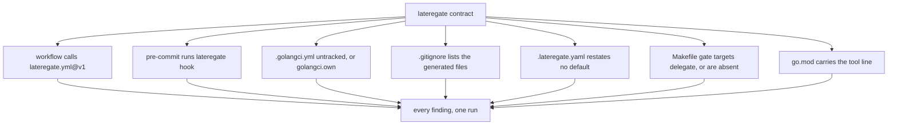

# contract reports drift

## The problem

With [[008-one-bar]] the gates themselves no longer live in a Makefile, so
`contract` has nothing to probe for. What remains per repository is a small
set of files that connect the binary to the places it is invoked from, and
each of them is a place to drift:

| File | Drift measured today |
|---|---|
| `.github/workflows/*.yml` | 19 repositories call `go-verify.yml@v1`; 2 run their own copy of the same jobs; 1 has none |
| `.githooks/pre-commit` | one 42-line script, byte-identical in 18 repositories, hardcoding `-newexpr=false -errorsastype=false` rather than reading the config it duplicates; absent in 4 |
| `.golangci.yml` | tracked in 2 repositories, generated in 20 |
| `.lateregate.yaml` | 20 of 20 restate a default |
| `Makefile` | 4 distinct `cover` recipes, 5 distinct `test-race` recipes |
| `go.mod` | pins from v0.17.0 to v0.25.2; one repository runs the tool with no pin |

## The decision

`contract` becomes the drift report. It reads the files above and fails on
every way they differ from the shape the organisation shares, naming all of
them in one run. It does not run gates; `check` does that.



### The checks

1. **Workflow.** Exactly one file under `.github/workflows/` contains
   `uses: latere-ai/ci/.github/workflows/lateregate.yml@v1`, and that file
   triggers on `push` to `main` and on `pull_request`. A caller still on
   `go-verify.yml` is reported as such, because the fix is different from
   "no workflow".
2. **Hook.** `.githooks/pre-commit` exists, is executable, and invokes
   `lateregate hook`. The hook's content beyond that line is the
   repository's own.
3. **Generated config.** `.golangci.yml` is not tracked by git, unless
   `golangci.own` declares it with a reason, in which case it must exist.
4. **Gitignore.** `.gitignore` lists `.golangci.yml` and `coverage.out`.
   A generated file that is not ignored is one `git add -A` commits.
5. **Restated defaults.** A `.lateregate.yaml` key whose value equals the
   default of [[008-one-bar]] D3 is reported with "delete it". A repository
   that restates a default has a line the next default change will make
   wrong.
6. **Hand-rolled targets.** A Makefile target named for a gate
   (`fmt-check`, `test`, `test-race`, `race`, `cover`, `lint`,
   `lint-config`, `lint-modernize`, `test-hermetic`, `hermetic`,
   `spec-lint`, `license`, `test-tempdir`, `tempdir`, `vuln`) must have a
   recipe that invokes `lateregate`. One that runs the gate itself is the
   drift 008 removed, reported by name. A Makefile may hold no gate targets
   at all: `make check` is a convenience, not a requirement.
7. **Pin.** `go.mod` carries `tool latere.ai/x/ci-gate/cmd/lateregate`.
   This repository, whose module *is* the tool, carries the same line for
   its own package.

Nothing here is waivable. A waiver says a repository is behind on a gate
and names the day it catches up; these are not gates, they are the wiring,
and wiring is fixed in the same commit that notices it.

### `hook`

The shared hook shrinks to a delegation:

```sh
#!/bin/sh
exec go tool lateregate hook
```

`lateregate hook` runs `fmt-check` and `modernize` over the staged Go
files and the packages holding them, reading `modernize.disable` from the
same config the full gate reads. The 42 lines that did this by hand in 18
repositories are deleted. golangci-lint is deliberately not in the hook: it
takes a global lock and a hook that serialises every commit on a machine is
one people bypass.

### `init`

`lateregate init` writes what `contract` checks, for a repository adopting
or catching up: the workflow caller if none exists, the hook, the gitignore
lines, and `git config core.hooksPath .githooks`. It never rewrites a file
that already carries the expected line, and it never touches `Makefile` or
`.lateregate.yaml`, because those hold decisions.

## Acceptance

1. `contract` on a repository with every file in shape passes and prints
   what it checked.
2. A repository on `go-verify.yml` fails with a message that names the
   switch, distinct from the message for no workflow at all.
3. A hook without `lateregate hook` fails; one with it and extra lines
   passes.
4. A tracked `.golangci.yml` fails unless `golangci.own` is set, in which
   case a missing file fails instead.
5. A config restating `modernize.disable: [newexpr, errorsastype]` fails
   and names the key.
6. A `cover` target that runs `go tool cover` fails; one that runs
   `go tool lateregate cover -profile=x` passes; a Makefile with no gate
   targets passes.
7. `hook` reads `modernize.disable` from config and passes the resulting
   flags to `go fix`.
8. `init` on an empty tree writes the four files, and on a tree already in
   shape writes nothing.
