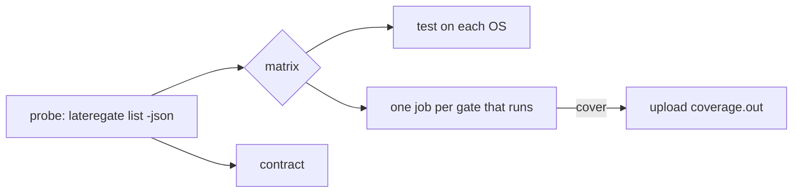

# The workflow runs lateregate

## The problem

`go-verify.yml` in `latere-ai/ci` holds eleven jobs, each of which probes
the consumer's Makefile for a target and runs it. Its `probe` step is a
copy of the required-target list, its `lint` job pins golangci-lint's
version a second time, and it has no job for `tempdir` or `vuln` because
each new gate needs a new job written in workflow YAML that cannot be run
locally.

With [[008-one-bar]] the binary knows which gates apply. The workflow
should ask it.

## The decision

A new reusable workflow, `lateregate.yml`, beside `go-verify.yml` rather
than replacing it. Consumers pin `@v1`, so editing `go-verify.yml` in place
would run against every consumer's pinned binary the moment it landed, and
the ones on a version without `list` would fail for the wrong reason. A
consumer switches its caller in the same commit it bumps the pin, and
`go-verify.yml` is deleted when the last caller has moved.



### Jobs

| Job | Runs | Why its own job |
|---|---|---|
| `probe` | `go tool lateregate list -json` | its output is the matrix |
| `test` | `go tool lateregate test`, on the `test_os` matrix | development is on macOS and deployment on Linux, and the asymmetry is structural |
| `gate` | `go tool lateregate <gate>`, one matrix entry per gate `probe` named, minus `test` | a failing gate names itself in the checks list, and slow gates run beside each other |
| `contract` | `go tool lateregate contract` | the wiring check runs even when a gate fails |

The `cover` entry uploads `coverage.out` as an artifact, as today.

Inputs shrink to `go_version` and `test_os`. `golangci_version` goes,
because the binary pins it. `run_lint` goes, because a repository that
cannot lint waives `lint` with a reason and a date, and the pipeline reads
that from the same file everything else does.

### The caller

```yaml
name: ci
on:
  push:
    branches: [main]
  pull_request:
permissions:
  contents: read
jobs:
  gate:
    uses: latere-ai/ci/.github/workflows/lateregate.yml@v1
```

This is the file `lateregate init` writes and `contract` checks for.

## Acceptance

1. `latere-ai/ci` carries `lateregate.yml` and `examples/lateregate.yml`,
   and its own test suite covers the probe's JSON handling.
2. This repository's `ci.yml` calls `lateregate.yml@v1` and passes.
3. `go-verify.yml` is unchanged by this spec.
