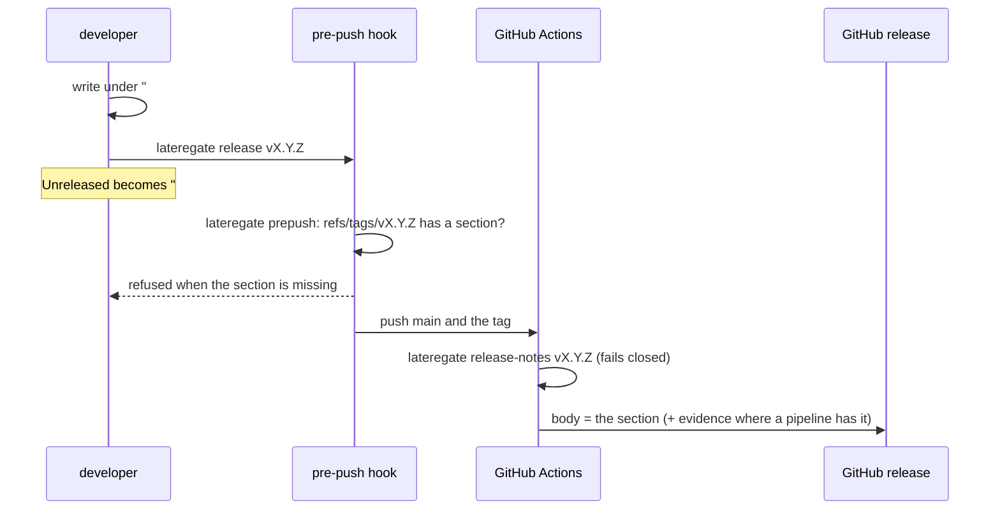

# A tag is a release, and a release has notes

## The problem

On 2026-09-06 the workspace held 30 repositories with a `v*` tag. One of
them, pkg, has a release note for every tag. The other 29 do not:

| Repositories | How the release body is made | What a reader gets |
|---|---|---|
| 13 services on `service-release.yml` (lux, auth, sandbox, ...) | GitHub `generate-notes`, `\|\| true` | one "Full Changelog" compare link, then the smoke evidence |
| latere-cli | goreleaser's commit list | raw commit subjects |
| wallfacer, service-template, agents, the two SDKs | `generate-notes` or `--generate-notes` | the compare link |
| ci-gate, latere-ui, topos | no release workflow | nothing |

`generate-notes` builds its body from pull request titles, and this
organisation commits to main directly, so the body is empty by
construction. The `|| true` behind it means an empty body has never failed
a release. A reader who wants to know what `lux v0.2.202` changed opens the
compare link and reads 14 commit diffs.

pkg holds the rule the others lack, in three places that agree: a
pre-push hook refuses to push a `v*` tag whose commit has no section in
`CHANGELOG.md`, the release workflow refuses the same tag and otherwise
publishes that section as the release body, and `make release VERSION=`
moves whatever sits under `## Unreleased` into the tag's section before it
tags. That is 90 lines of shell in one repository. Copying it into 29 more
is the drift [[009-contract-reports-drift]] exists to prevent, and nothing
would make a repository that never copied it start.

## The decision

The changelog rule moves into the binary, and the binary holds it in the
three places pkg held it plus the one that makes it universal.

**`CHANGELOG.md` is the source, and its shape is pkg's.** A level-two
heading whose second word is the tag opens a section that runs to the next
level-two heading. `## v0.55.0 - 2026-09-06` and `## v0.55.0` both name
`v0.55.0`. `## Unreleased` holds what the next tag will say. A section is
empty when it holds only whitespace. The format is what pkg has used for 87
tags, and no other repository has a changelog to migrate.

**`lateregate release-notes TAG [REF]` prints the section, or fails.** With
no `REF` it reads the working tree; with one it reads
`git show REF:CHANGELOG.md`, which is what the hook needs because the tag
being pushed may not be checked out. A missing file, a missing heading and
an empty section each fail with the fix named: add the section, or run
`lateregate release`. This is the one implementation; the hook, the
workflow and the cut all call it.

**`lateregate prepush` refuses a release tag with no section.** It reads
the same ref lines it reads today. A local ref under `refs/tags/` whose name
is a release tag (`vMAJOR.MINOR.PATCH` with an optional prerelease and build
suffix, so `v1` as a moving major tag is not one) and whose local sha is not
zero is checked at that sha. The check runs before the lint, because it is
a file read and the lint is not, and a tag push that fails should fail in
under a second. Branch refs are unchanged. A deletion is not a release.

**`lateregate release VERSION` cuts the tag.** It refuses a dirty tree, an
existing tag, a `VERSION` that is not a release tag, and an empty
`## Unreleased`. Then it writes `## VERSION - <today>` under a fresh
`## Unreleased`, verifies the section it just made by reading it back,
commits `changelog: VERSION`, creates an annotated tag, and pushes `HEAD`
and the tag in one push, so the pre-push sees both and the release workflow
runs once. The date is the day the tag is cut, which is the day the section
stops changing.

**`contract` wants the changelog, and `init` seeds it.** `CHANGELOG.md` is
tracked at the root and carries a `## Unreleased` heading, in every
repository, whether or not it has tagged yet. A repository that never tags
carries an empty changelog, which costs nothing; a repository that starts
tagging finds the rule already there, which is the point. `init` writes the
seed file when there is none: the two-paragraph header pkg carries, and
`## Unreleased`. A `Makefile` target named `release` or `release-notes`
delegates, by the rule every gate target follows.

**What stays out.** The binary does not publish the GitHub release; that is
a pipeline's job and lives in latere-ai/ci, which calls `release-notes` in
each of its release workflows and fails closed when the section is missing.
The binary does not draft a section from the commit log: a note is written
for the reader of the release, and the commit log is written for the reader
of the diff. That helper can be added when a repository that tags daily
shows the cost is real.

## Acceptance

1. `release-notes v1.2.3` on a changelog with `## v1.2.3 - 2026-09-06`
   prints the section and nothing else; on a changelog with the heading and
   only whitespace under it fails and names the heading; on a changelog
   without the heading fails and names `lateregate release`; with no
   `CHANGELOG.md` fails and says so.
2. `release-notes v1.2.3 <sha>` reads the file at `<sha>`, not the working
   tree.
3. `prepush` fed `refs/tags/v1.2.3` at a sha whose changelog has the
   section passes and runs no lint; at a sha whose changelog lacks it fails
   and names the tag; fed `refs/tags/v1` runs nothing; fed a tag deletion
   runs nothing; fed a branch ref behaves as before.
4. `release v1.2.3` on a clean tree with a non-empty `## Unreleased`
   rewrites the file so `release-notes v1.2.3` returns what was under
   `Unreleased`, leaves `## Unreleased` empty above it, commits, tags, and
   pushes `HEAD` and the tag in one command; on a dirty tree, an existing
   tag, a bad version, or an empty `Unreleased` it writes nothing and names
   the reason.
5. `contract` on a repository without `CHANGELOG.md` fails and names
   `init`; with the file untracked fails; with the file tracked and no
   `## Unreleased` heading fails; `init` writes the seed and `contract`
   then passes. A `Makefile` target `release` that does not delegate is
   reported.
6. The pkg repository's pre-push loses its own changelog lines, its
   Makefile targets delegate, its scripts are deleted, and `contract`
   passes.
7. Each package in this repository stays at or above the coverage floor.

## Rollout

Tag this repository. latere-ai/ci then pins the tag in its release
workflows and cuts `v1`; that rollout, and the per-repository adoption, is
the ci spec's. This repository adopts its own rule in the same tag: a
`CHANGELOG.md` with a section for it, and a release workflow once ci
publishes one to call.

## Outcome

Shipped as v0.29.0 on 2026-09-06, cut with `lateregate release` itself;
v0.29.1 the same hour added this repository's release workflow and was the
first tag published through `notes-release.yml`. latere-ai/ci v1.8.0 pins
the reader in all four release pipelines. Every acceptance criterion holds;
the changelog package sits at 96.9% coverage.

- Rolled to 27 repositories the same day: the 23 on lateregate took the
  pin and the seed changelog through `lateregate init` from a clean
  worktree of `origin/main`; latere-ui and the two SDKs took a hand-written
  seed and a workflow edit; pkg lost its two scripts and its hook's own
  lines (acceptance 6).
- The `release` target rule caught llmops, whose `make release` built and
  pushed runtime images. It is `make push-images` now: a release is a git
  tag with a section, and the name is that command's everywhere.
- Five repositories (managed-agents, pay, platform, service-template, tgo)
  had no committed pre-push at all, so the tag rule would have run only in
  CI there; the shared hook was committed in each. managed-agents still
  drifts on its caller, its restated defaults and its hand-rolled targets,
  none of which this spec touched.
- images publishes no GitHub release (its tag pushes images and republishes
  on the `release` event), so it took nothing; adopting `images-release.yml`
  there is its own change.
