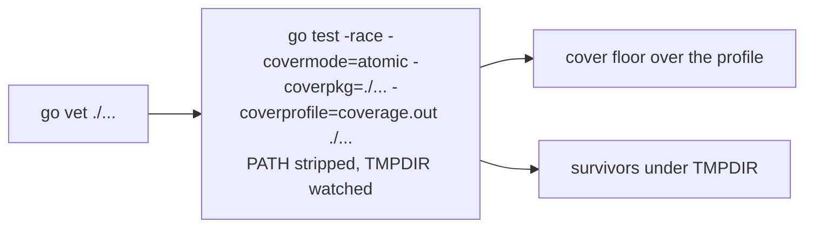

# One instrumented run of the suite carries five gates

## The problem

Five gates run `go test ./...` and differ only in what they wrap around
it: `test` runs it after vet, `race` under the detector, `cover` with a
profile, `tempdir` inside a watched TMPDIR, `hermetic` with a stripped
PATH. In CI each is its own job, so a push compiles and runs the suite
five times on five runners and pays checkout and toolchain setup five
times over. On origo that is 14.5 billed minutes of a 21 minute gate set,
and the suite itself is 2.4 of them.

The properties are independent of each other and none of them is
independent of the suite, so one run can hold all five. `go test -race`
already forces `-covermode=atomic`, a watched TMPDIR watches whatever
runs inside it, and a stripped PATH strips it for whatever runs inside
it.

## The decision

**A `suite` gate runs the suite once with every wrapper on, and the five
gates fold into it in the plan.**

- `suite` runs `go vet`, then one `go test` with `-race`, the cover
  profile flags of `cover.Collect`, `CGO_ENABLED=1`, the hermetic PATH,
  and the tempdir sandbox around it. It then applies the cover floor to
  the profile and reports TMPDIR survivors. Each failure names the
  property in its first line: `the suite is not race-clean`, `package X
  is under the floor`, `the suite left N entries under TMPDIR`, so the
  job name no longer has to.
- `lateregate list -json` reports `test`, `race`, `cover`, `tempdir` and
  `hermetic` with status `folded` and `into: suite`. The reusable
  workflow's probe already keeps `test` out of the gate matrix; it now
  runs `suite` in the OS matrix job instead and drops every folded gate
  from the matrix. The coverage artifact uploads from that job.
- The five subcommands stay. A developer isolating one property runs it
  by name, and `lateregate` with no arguments runs `suite` in their
  place. Nothing a repository pinned stops working.
- Waivers keep their names and narrow the run instead of skipping a job:
  a waived `race` drops `-race`, a waived `hermetic` keeps the full PATH,
  a waived `tempdir` skips the sandbox, a waived `cover` skips the floor,
  and a waived `test` waives `suite`. `contract` accepts the folded names
  as before.
- The race detector needs cgo, and cgo needs a C compiler that the
  stripped PATH would hide. `Hermetic.PathFor` gains the directory of the
  `cc` it resolves before stripping, and reports it in the PATH line it
  prints. A repository that waives `race` gets the old strict PATH.
- One run costs one build and one suite under `-race`, about the
  duration of today's `race` job. Wall clock for a push rises from the
  longest of five parallel jobs to that one job; billed minutes fall from
  five jobs to one. On the self-hosted runner with two slots the
  parallelism was never there to lose.

## Acceptance

- `suite` fails on a data race, on a package under the floor, on a TMPDIR
  survivor, and on a test that shells out to a tool off the stripped PATH,
  each with the named first line, and passes a repository where all four
  hold. One fixture per failure.
- `list -json` marks the five gates `folded` with `into: suite` and no
  longer marks them `run`; a waiver on any of the five narrows `suite`
  and shows in its plan line.
- `lateregate.yml` runs `suite` in the test matrix job, excludes folded
  gates from the gate matrix, and uploads `coverage.out` from the matrix
  job. The copy of the probe shell in `ci/test/lateregate_test.sh` is
  updated with it.
- On origo, a push runs one suite job per OS and no `race`, `cover`,
  `tempdir` or `hermetic` job, and the gate set's billed minutes drop by
  at least eight.
- The hermetic PATH line shows the compiler directory when `race` is on
  and not when it is waived.
