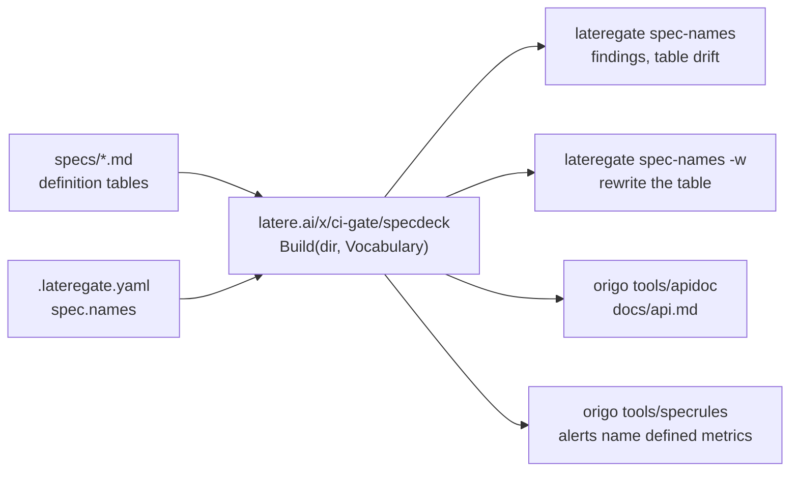

# The spec deck's cross-reference is one parser and one gate

## The problem

A spec deck defines names: error codes, configuration variables, metrics,
event kinds, endpoints, headers, failpoints. One spec owns each name and
the rest of the deck cites it. Two failures follow, and review sees
neither: a name defined twice, so two decisions carry one word, and a name
cited that no spec defines, so a reader follows a citation into nothing.

Origo and Insula each answer this with `tools/specindex`, a module under
`tools/` that parses the deck, renders a cross-reference table into the
markers at the end of `specs/README.md`, and fails a test when the table
and the specs disagree. The two are the same tool written twice:

| | Origo | Insula |
|---|---|---|
| Parser | `tools/specindex/specs/index.go`, 399 lines | `tools/specindex/index.go`, 446 lines |
| Command | `main.go`, 109 lines | `main.go`, 71 lines |
| Extra | `specs/rules.go`, 116 lines, the `-rules` alert check | none |
| Package | exported, `tools/apidoc` imports it | `package main` |
| Drift check | `go test ./...` in a CI job of its own | `go test ./...` in a CI job of its own |

They diverged by roughly 260 lines. Each grew a fix the other does not
have: Insula reads code fences before it reads tables, so a sample table
in a fenced block does not define names, and Origo does not; Origo splits
`Origo-Event: push` into a mention of the header and a mention of the
event, and Insula does not. Neither divergence was a decision. Each was
found in one deck and fixed where it was found.

This is the shape [[000-bootstrap]] describes and the reason this
repository exists, with one addition: the drift check is a `go test` in a
module nobody builds, so it runs on a runner and not on a laptop, which
[[001-gate-principles]] D1 names as the failure a gate exists to remove.

## The decision

**The parser becomes a package this module exports. The drift check
becomes a gate, opt-in through `.lateregate.yaml` the way `registers` is.
Both repositories delete `tools/specindex` and its CI job.**



### Where the library lives

Three candidates, and the repository has already written down why one of
them is wrong.

**`latere.ai/x/pkg`.** Rejected, by [[001-gate-principles]] D1 verbatim:

> It is also the reason the tool is not in `latere.ai/x/pkg`. That module
> is 45 packages with otel, grpc, golang-migrate and goldmark in its
> graph, and 16 repositories depend on it for runtime code. A build-time
> gate should not drag that in, and a fix to a coverage tool should not
> force a version bump on 16 repositories.

Every clause holds for a deck parser. It is build-time, its consumers are
two, and a fix to it would move a version 16 repositories carry at
runtime. [[002-dependency-footprint]] restates the same argument as this
repository's reason to exist. `pkg`'s own rule -- a generic package with a
plausible second consumer is written there first -- is a rule about
*where generic runtime code goes*, and it does not overturn D1: `pkg`
carries client primitives, and a Markdown deck parser is not one. There is
also a mechanical objection. `pkg` pins `lateregate` as a tool, so
`latere.ai/x/ci-gate` is already in `pkg`'s module graph; a gate importing
`pkg` would put each module in the other's graph and make every parser fix
a two-hop release.

**A module of its own, `latere.ai/x/specdeck`.** Rejected on cost against
benefit. It buys separation this has no use for and costs a repository,
a workflow, a changelog, a licence, a `.lateregate.yaml`, a release
ritual, and a `depcheck` entry here with a reason -- for about 500 lines
with two consumers, both of which already carry `latere.ai/x/ci-gate`.
Worse, it reintroduces the failure being removed one level up: `lateregate
vX` would pin parser `vY` while `apidoc` pins `vZ`, and the gate would
then pass or fail on a table the renderer would not produce. Two versions
of one parser is the drift this spec exists to end.

**A package this module exports: `latere.ai/x/ci-gate/specdeck`.
Chosen.** No new module anywhere. The gate and the parser ship as one
version, so the table the gate checks is the table the renderer writes, by
construction. Origo already carries `latere.ai/x/ci-gate` from its tool
directive, so `tools/apidoc` requiring it adds a module to nobody's cache.
The dependency a consumer takes on is `goccy/go-yaml` and the standard
library, which [[002-dependency-footprint]] gates.

The cost, stated: this module exports nothing today. Every package is
`internal/`, deliberately, because the product is a binary and a binary
has no compatibility surface. `specdeck` breaks that boundary and puts a
library API under a 0.x tool's release cadence. Two things bound it. The
package is public for exactly one external consumer, `origo/tools/apidoc`,
and the surface below is the whole of it. And the consumer is a build-time
tool in a repository this organisation owns, so a breaking change is a
compile error in a tool module, found by the same push that makes it,
rather than a break in somebody's running service.

### The public API

```go
package specdeck // latere.ai/x/ci-gate/specdeck

// Kind is one class of name a deck defines, as its table prints it:
// "error code", "endpoint", "manifest key".
type Kind string

// KindSpec declares one kind. Headers are the leading header cells that
// mark a defining table, matched case-insensitively: ["Code"], or
// ["Method", "Path"], where the name is the method and the path joined by
// a space and a cell holding "GET, POST" defines one name per method.
// Pattern, when set, is the shape a backticked token takes when it
// mentions this kind. Group, when set, joins kinds that resolve one
// another's names, so a token shaped like a variable finds a definition in
// any variable kind.
type KindSpec struct {
	Headers []string
	Label   Kind
	Pattern string
	Group   string
}

// Vocabulary is what one deck names and how. Nothing about a deck is
// compiled in: the kinds, the token shapes and the resolution order are
// the one fact no shared rule can know.
type Vocabulary struct {
	Kinds   []KindSpec
	ByName  []Kind            // kinds a shapeless token resolves against, in order
	Exclude map[string]string // token -> why it is not the name it looks like
}

// Validate reports a vocabulary that cannot be applied: no kinds, a kind
// with no headers or no label, two kinds with one label, a pattern that
// does not compile, a ByName entry that is not a declared label, or an
// Exclude entry with an empty reason.
func (v Vocabulary) Validate() error

// Name is one defined name. Header and Row are the defining table's header
// cells and the cells of the row that defines it, as the spec writes them,
// so a renderer reproduces the table rather than inventing one. Line is the
// row's line number in the spec, the order a reader meets it in.
type Name struct {
	Kind   Kind
	Name   string
	Owner  string   // the spec number, "004"
	Also   []string // other spec numbers that mention it, sorted
	Header []string
	Row    []string
	Line   int
}

// Index is the deck's names and the findings against them.
type Index struct {
	Names    []Name   // by kind in Vocabulary order, then by name
	Findings []string // sorted
}

// Build reads every NNN-*.md under dir and indexes it against v.
func Build(dir string, v Vocabulary) (*Index, error)

// File is the spec file that owns a number: File("004") is
// "004-write-ahead-log.md".
func (idx *Index) File(num string) string

// Numbers reports the spec numbers the index read, in order.
func (idx *Index) Numbers() []string

// Table renders the cross-reference table.
func (idx *Index) Table() string

// Missing reports every declared kind that no defining table produced.
func (idx *Index) Missing() []Kind

// Markers delimit the generated table in the index file.
const (
	BeginMarker = "<!-- specindex:begin -->"
	EndMarker   = "<!-- specindex:end -->"
)

// Current reads the table between the markers of path.
func Current(path string) (string, error)

// Splice writes table between the markers of path.
func Splice(path, table string) error
```

The markers keep the strings both decks already carry, so no deck edits a
`README.md` to adopt this.

`Build` takes the vocabulary as an argument rather than reading config,
because one process indexes two decks: Insula's spec 026 checks that every
`/v1/repos` path it names is one Origo's deck defines, which means
building Origo's deck with Origo's vocabulary from inside Insula.

### The rendered table

Unchanged from what both decks carry today, so adopting this rewrites
values and not shape:

```
| Kind | Name | Owner | Also named in |
|---|---|---|---|
| error code | `forbidden` | [003](003-protocol-contract.md) | 007, 010, 020, 021 |
| header | `Origo-Stale` | [015](015-degraded-storage.md) | 003, 011 |
```

Rows are grouped by kind in `Vocabulary.Kinds` order and sorted by name
within a kind. `Owner` links the spec number to its file. `Also named in`
is the sorted spec numbers that mention the name and do not own it, or `-`.

### The gate

`spec-names`, in the binary with the rest of the bar, holding the four
principles of [[001-gate-principles]] the way [[013-registers-gate]] does.

- **D1**: it reads Markdown and `.lateregate.yaml`. No toolchain call, no
  network, no second module. It runs from the module cache.
- **D2**: what a deck names is the one fact no shared rule can know, so
  the repository declares it:

  ```yaml
  spec:
    names:
      # The file whose markers hold the generated table. Its own key:
      # spec.index is the status table in the same file, and one word must
      # not mean two tables.
      table: specs/README.md
      kinds:
        - {headers: [Code], label: error code}
        - {headers: [Variable], label: variable, pattern: '^(ORIGO|OTEL)_[A-Z0-9_]+\*?$'}
        - {headers: [Metric], label: metric, pattern: '^origo_[a-z0-9_]+$'}
        - {headers: [Event], label: event}
        - {headers: [Method, Path], label: endpoint, pattern: '^(GET|POST|PUT|PATCH|DELETE|HEAD) /'}
        - {headers: [Header], label: header, pattern: '^Origo-[A-Za-z-]+$'}
        - {headers: [Failpoint], label: failpoint}
      by_name: [error code, event, header, failpoint]
  ```

  `spec.dir` says where the specs are, as it already does for `spec-lint`.
- **D3**: the gate applies when `spec.names.kinds` declares a kind. Opt-in
  rather than waivable, for [[013-registers-gate]]'s reason: a repository
  with no key has decided nothing, and a check that fired on a deck whose
  vocabulary nobody declared would report every backticked token in it.
  Once opted in, the way out is `waive`, with a reason and a date. An
  `exclude` entry carries its reason as the value, so it cannot exist
  without one.
- **D4**: a declared kind that no defining table in the tree produces
  fails, the way a named user surface no file calls fails 013. A typo in a
  header cell would otherwise turn one kind off silently. A tree with the
  markers missing fails, and a tree the vocabulary finds no name in fails.

### What is reported

One line per finding, in the developer register, because a gate's output
is a developer surface:

```
  error code "forbidden" is defined by 003 and by 007
  019-repository-administration.md: metric "origo_imports_total" is named but no spec defines it
  specs/README.md: the table differs from the specs; run go tool lateregate spec-names -w
  the kind "failpoint" is declared and no table defines one
lateregate: 4 finding(s) against the spec deck
```

A pass names the figures, so a pass over four names and a pass over four
hundred are distinguishable: `spec-names: 214 names of 7 kinds across 27
specs, specs/README.md current`.

`lateregate spec-names -w` rewrites the table between the markers and
writes nothing else. It reuses the `-w` the flagset already declares for
`license`; a gate cannot rewrite a file, and the writer is the same
subcommand so the reader never has to find a second tool.

### Root reachability moves with the deck

Insula's module also carries `TestSpecDependencyClosure`: every spec
reaches spec 001 through `depends_on`. `internal/speclint` checks that
edges resolve and that the graph is acyclic, and not that it has a root, so
deleting the module would delete a live rule. It is spec-tree hygiene and
belongs to the gate that already holds it:

```yaml
spec:
  root: 001-architecture.md
```

Set, `spec-lint` reports every spec that does not reach it. Empty, the rule
is off, which is what every other tree here wants. This is the one addition
outside the cross-reference, and it is here because the migration would
otherwise drop a check nobody decided to drop.

### Reconciling the two copies

Every difference, classified three ways. A bug fix wins everywhere; a deck
property becomes vocabulary; a genuine conflict is decided and the reason
is written down.

| Difference | Ahead | Disposition |
|---|---|---|
| A table inside a code fence is read as a definition table | Insula tracks fences | **Bug fix**, unconditional. A sample table in a fenced block defines nothing. |
| A `Method` cell holding `GET, POST` defines one name | Insula splits on the comma | **Bug fix**, unconditional. Two methods on one path are two names. |
| A mention carrying a query, a fragment, or prose after the path resolves to nothing | Insula cuts the tail | **Bug fix**, unconditional. The name is the method and the path. |
| A token naming a family, `INSULA_` or `LATERE_*`, is read as a variable | Insula skips it | **Bug fix**, refined: a token ending `_` or `_*` is a family unless a definition names it exactly, so a deck that really defines `ORIGO_TLS_*` keeps it. |
| A definition carrying `<placeholder>` segments matches its instances, longest literal winning and ties going to the first by name | Insula | **Kept**, unconditional. Inert on a deck whose definitions carry no `<`. |
| `Origo-Event: push` mentions the header and the event kind | Origo splits both sides | **Origo wins**, unconditional. The split emits the whole token and both sides; a side that resolves to nothing is dropped, so it adds mentions and never a finding. Insula's rule, which strips the value and keeps the name, is a subset of it. |
| `Name` carries the defining row's header cells, cells and line | Origo, for `apidoc` | **Kept**, unconditional. It costs nothing and it is what makes a second renderer possible. |
| A metric named with its labels mentions the metric | both, keyed on the deck's prefix | **Derived**: a token whose `{...}` is stripped and whose prefix matches the kind's pattern is that kind. No key. |
| The kinds: failpoint against cli, build and injected variable, table, manifest key | both | **Vocabulary**: `kinds`. |
| The token shapes: `ORIGO\|OTEL` against `INSULA\|SPACES\|…`, `origo_` against `insula_`, `Origo-` against `X-Insula-\|Origo-`, the method list with and without `ANY` | both | **Vocabulary**: `pattern` per kind. |
| Four variable kinds resolve one another's names | Insula | **Vocabulary**: `group`. Origo's variable kind is a group of one. |
| Tokens shaped like a metric that name something else: `insula_gate`, `insula_gate_flow`, `insula_routes` | Insula | **Vocabulary**: `exclude`, keyed by the token with the reason as the value, per D3. |
| A shapeless token resolves against error code, event, header, failpoint (Origo) or error code, event, table, manifest key (Insula) | conflict | **Vocabulary**: `by_name`, explicit and ordered. Not derived from "the kind has no pattern": Origo's `header` kind has a pattern and still has to resolve `Retry-After`, which the pattern does not match, while Insula's `table` and `manifest key` have no pattern at all. No rule covers both, so the deck names the list. |
| `run(args, stdout, stderr) int` against a `main` that calls `os.Exit` | Origo | **Moot**: the gate replaces both commands. |
| SPDX `MIT` against `LicenseRef-Proprietary` | both | The library is this module's, so `MIT`, and `license` gates it here. |

Both decks change when they adopt this, because four of the fixes change
which mentions resolve. The regenerated table is part of the adopting
commit, and a finding the reconciled parser raises against a live deck is
deck work in that repository: a definition to add, a backtick to remove,
or a dated `waive: spec-names` naming the work. Nothing here asserts the
diff is empty.

### The Prometheus alert mode stays in Origo

`tools/specindex/specs/rules.go` does two Origo things. It extracts the
plain Prometheus rules document from inside the `PrometheusRule` of Origo
spec 011, which is what `promtool check rules` parses, and it fails when an
alert names an `origo_` metric no spec defines. The first reads a
Kubernetes manifest and no spec at all; the second needs only
`Index.Names` filtered to the metric kind, which the exported API gives.

It is not a fleet gate. One repository ships alerts, so by `pkg`'s own rule
the second consumer has not appeared, and a gate here would apply to one
deck. It moves to `origo/tools/specrules`, a module under `tools/` that
imports `specdeck`, which leaves Origo with the two tool modules it has
today. Folding it into `tools/apidoc` was considered and rejected on one
test: after the fold, the command's name would no longer describe what it
does, and renaming `apidoc` is a rename this spec does not ask for.

### How `tools/apidoc` consumes the library

`docs/api.md` is rendered by `origo/tools/apidoc`, its own module under
`tools/`, which today reads the deck through
`github.com/latere-ai/origo/tools/specindex/specs` behind a `replace`.
The change is two lines of `go.mod` and one import:

```
-require github.com/latere-ai/origo/tools/specindex v0.0.0
-replace github.com/latere-ai/origo/tools/specindex => ../specindex
+require latere.ai/x/ci-gate vX.Y.0
```

`Page(idx)` reads `Name.Kind`, `Name.Header`, `Name.Row`, `Name.Owner` and
`Index.File`, all of which the API above carries, so the renderer changes
only its import path and where the vocabulary comes from. `apidoc` gets
Origo's vocabulary the way the gate does, from `.lateregate.yaml`, so the
page and the table cannot be built from two readings of one deck. `make
docs` and the workflow's `git diff --exit-code docs/` step are unchanged.

**What this means for Origo's spec 001 invariant 7.** Nothing. The
invariant is about the module `github.com/latere-ai/origo`, whose direct
dependencies are the standard library, `latere.ai/x/pkg`, and the
OpenTelemetry SDK confined to `internal/tracing`, and whose `depcheck`
gate is configured over the build list of `./cmd/origod`. `tools/apidoc`,
`tools/specrules` and `tools/spike` each have their own `go.mod`, which is
exactly why they are separate modules: a module under `tools/` is not on
the service's build list, `go list -deps ./cmd/origod` never reaches it,
and nothing it requires links into `origod`. Origo spec 001 already says
so, in the fourth acceptance criterion: "`tools/spike` is its own module
and is not on the build list." `latere.ai/x/ci-gate` is additionally
already in Origo's `go.mod` as an indirect requirement of the `tool`
directive, so this adds no module to the repository at all.

## Migration

The order across the repositories, with the property that makes each step
safe stated rather than assumed: **the gate is opt-in on
`spec.names.kinds`, so a repository that has not declared a vocabulary
skips it whatever version of `lateregate` it pins.** That is what lets the
tool ship before any deck adopts it, and it is the same property
[[013-registers-gate]] shipped on.

The second property: **the gate must never run against a table the shared
parser did not produce.** So per repository the vocabulary, the tool pin
and the regenerated table land in one commit, and the old module is
deleted in the same commit that the gate starts covering the deck. There
is no window in which the deck is unchecked, which [[001-gate-principles]]
D4 would refuse.

1. **ci-gate.** `specdeck`, the `spec-names` gate, the `spec.names`
   section, `spec.root` in `speclint`, the README entry. Release
   `vX.Y.0`. No repository declares `spec.names`, so every repository's
   plan gains one `SKIP spec-names spec.names declares no kind` line and
   nothing else changes. This tree keeps no cross-reference table, so the
   gate skips here too.
2. **Origo**, one commit, after that release. `.lateregate.yaml` gains
   `spec.names` and the tool pin moves to `vX.Y.0`; `specs/README.md` is
   regenerated with `spec-names -w` and the deck findings the reconciled
   parser raises are fixed in the same commit; `tools/specindex` is
   deleted and `tools/specrules` added; `tools/apidoc/go.mod` swaps its
   `require` and `replace` for `latere.ai/x/ci-gate`; the `Makefile`'s
   `specindex` target goes and `docs` points its rules step at
   `tools/specrules`. The workflow's `specindex` job **is not deleted**:
   it loses the `go test` step, keeps promtool and keeps `make docs` plus
   `git diff --exit-code docs/`, and is renamed for the two things it
   still does. Green: the `gate` job runs `spec-names` over the
   regenerated table, and the surviving job runs the two checks the gate
   does not hold.
3. **Insula**, one commit, after the same release and independent of
   Origo. `.lateregate.yaml` gains `spec.names`, its three `exclude`
   entries and `spec.root`; the tool pin moves; `specs/README.md` is
   regenerated and the deck findings fixed; `tools/specindex` is deleted
   and the `specindex` job with it, because unlike Origo's it holds
   nothing else. Of the module's three tests that are not about the
   index, `TestSpecDependencyClosure` becomes `spec.root`, and
   `TestDiagramsRender` and `TestOrigoContractPaths` are dropped: Insula's
   workflow never puts `mmdc` on `PATH` and never sets `ORIGO_SPECS_DIR`,
   so both have always skipped in CI. Dropping a test that never ran is
   not a loss of coverage, and the intent of the second one is recorded as
   an open criterion on Insula's spec 026, which `Build`'s vocabulary
   argument keeps buildable.
4. **latere-ai/ci.** Nothing. The reusable workflow builds its matrix from
   `lateregate list -json`, so `spec-names` joins the gate set with no
   workflow change, and it is named here only so a reader does not go
   looking for the fourth commit.

Steps 2 and 3 are in either order. Neither repository can red the other,
and neither can red a repository that has not adopted.

## Acceptance criteria

- `lateregate list` on a repository without `spec.names.kinds` shows
  `SKIP spec-names spec.names declares no kind`, and the plan is otherwise
  the plan it printed before.
- A deck defining one name in two specs, and a deck citing a name no spec
  defines, each fail naming the kind, the name, and the specs involved.
  One fixture per failure.
- A table between the markers that differs from the specs fails naming the
  file and the writer; `spec-names -w` on the same tree makes it pass and
  changes no other byte of the file.
- Markers missing, a vocabulary that matches no name in the tree, and a
  declared kind no table produces each fail, and each says which of the
  three it is.
- Every reconciliation marked **bug fix** in the table above has a fixture
  that fails on the pre-fix behaviour: a definition table inside a fence,
  a `GET, POST` method cell, a mention carrying `?q=1`, and a `LATERE_*`
  family token.
- A `<placeholder>` definition resolves its instance and the longest
  literal wins over a shorter one; a deck with no `<` in any definition
  indexes identically with the rule on and off.
- A token in `exclude` is not a mention of the kind its pattern matches,
  and an `exclude` entry with an empty reason is rejected by `Load`.
- A `by_name` kind that carries a pattern still resolves a name the
  pattern does not match, which is Origo's `Retry-After`.
- `Build` indexes two decks with two vocabularies in one process and the
  second does not see the first's names.
- A vocabulary with no kinds, a kind with no headers, two kinds sharing a
  label, a pattern that does not compile, and a `by_name` entry naming no
  declared kind are each rejected by `config.Load` with the key named.
- `spec.root` set fails a spec that reaches no root and passes a tree
  where every spec does; unset, the rule reports nothing.
- Origo's and Insula's declared vocabularies are both fixtures here, each
  indexing a small deck in that repository's shape, so a change to the
  parser that would break either is found in this repository.
- `specdeck` and the gate each clear the 90% floor.
- The README gains `spec-names` in the gate list and `spec.names` in the
  configuration reference, with the two vocabularies as the worked
  examples.
