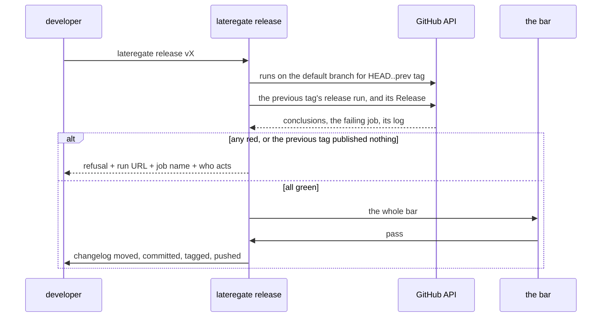

# Green before you cut, and the refusal says who acts

## The problem

On the night of 2026-09-16 three Origo tags were cut in a row. Each one
deployed. None of them published a GitHub Release, and nobody noticed for a
day.

The release workflow runs its jobs in order: build, deploy, then publish the
notes. The publish job failed. The deploy job before it had already
succeeded, so the cluster moved and the tag looked live. The run was red in
the Actions tab the whole time, and the next cut read nothing before it
tagged, so the second tag repeated the first failure and the third repeated
the second.

Two separate holes made that possible.

**The cut reads no CI.** `lateregate release` runs the whole bar on the tree
it is about to tag ([[012-a-tag-is-a-release]]), which is the local bar and
nothing else. It does not ask GitHub what the last push did. A `main` that
has been red since yesterday afternoon cuts a tag tonight without a word.

**A run that succeeded is not a release that exists.** Even a green release
run is only evidence that the workflow finished. The thing a reader wants is
the Release object. The two can disagree, and on the night they did: a run
whose publish job never ran leaves a tag with a deploy behind it and no
notes in front of it.

Underneath both is the reason nobody caught it by hand: CI failures reach a
person only if a person reads CI. Between a tag push and the next cut there
is exactly one moment where a machine is already looking at the repository
and a human is already waiting, and that is the cut. The check belongs
there.

The maintainer's standing instruction, given the morning after, is the third
constraint:

> continue only if CI is green; if red because of budget reasons, ask me to
> act.

So a refusal is not enough. The refusal has to say whose problem it is. Three
kinds of red want three different people: an exhausted Actions budget or an
org policy refusal is the maintainer's and nobody else's, a registry that
answered `DENIED` wants the job run again, and a failing test wants a commit.
A refusal that says only "CI is red" hands all three to whoever ran the cut,
who then reads the log the guard already read.

## The decision

`lateregate release` grows one guard with two rules, and every refusal it
writes ends with a line naming who acts.



The guard runs **before** the bar, not after. A red `main` is known from
three API reads; the bar is a full test run under the race detector. Paying
for the second to learn the first is the wrong order, and on a repository
whose suite takes minutes it is the difference between a refusal a person
waits for and one they walk away from.

### Rule 1: green before you cut

Before anything is written, the guard reads three things and refuses on any
of them.

**(a) Every workflow that ran on the default branch in this tag's window.**
The window is `HEAD` and its ancestors back to the previous release tag, the
same commits the section under `## Unreleased` describes. For each workflow
that has a completed run on the default branch at one of those commits, the
guard takes the latest such run. A `failure` or a `cancelled` is a refusal.

The set of workflows is derived from the runs the API returns, not from the
files in `.github/workflows/`. A workflow that triggers only on tags, like
`release.yml`, has no run on the default branch and would otherwise make the
guard refuse forever.

**(b) The previous tag's release run.** The run at the previous release
tag's commit whose head ref is that tag. A `failure` or a `cancelled` is a
refusal, which is exactly the Origo case: the run that deployed and did not
publish.

**(c) The Release the previous tag should have.** If (b) succeeded, the
guard asks for the Release object at the previous tag. A 404 is a refusal:
`vX-1 deployed but published nothing`. A workflow can finish green and still
publish nothing, and this is the only check that can tell.

**Nothing passes vacuously** ([[001-gate-principles]]). A window with no
completed run at all is not green, it is unknown, and the guard refuses
naming the branch and the window. Cutting three minutes after a push, while
every run is still `in_progress`, is the case this catches.

### Rule 2: say who acts

For each red run the guard fetches the failing job's log, takes the last
2000 lines of it, and classifies. The run's own conclusion is read alongside
the log, because a run can be red before any job produced output.

| Actor | The run or the log names | Example line |
|---|---|---|
| `BUDGET` | Actions minutes, billing, a spending or usage limit, runner capacity, an org policy refusal | `You have exceeded your included usage limit for GitHub Actions.` |
| | | `GitHub Actions is not permitted to create or approve pull requests.` |
| | | `No runner available matching labels: ubuntu-latest` |
| `INFRA` | a registry refusal, a reset connection, a certificate or DNS failure | `denied: requested access to the resource is denied` |
| | | `read tcp 10.1.2.3:443: connection reset by peer` |
| | | `x509: certificate signed by unknown authority` |
| | | `dial tcp: lookup ghcr.io: no such host` |
| `CODE` | anything else | `--- FAIL: TestCutRefusesADirtyTree (0.00s)` |

Precedence is `BUDGET`, then `INFRA`, then `CODE`. A log holds both a reset
connection and a usage limit when a runner dies mid-pull on an exhausted
account, and in that case the maintainer is still the one who has to act.
`CODE` is the fallback rather than a match, so an unreadable log or a log
nobody anticipated still names somebody.

A refusal's headline is `ci is red` and names no branch: a run on the
default branch and the previous tag's release run are both red CI, and the
branch each one ran on is in the finding line under it. Where more than one
run is red the findings are listed together and the closing line names the
highest-precedence actor among them, because that is the one whose fix has
to happen first.

The last line of every refusal is one of exactly three:

```
BUDGET: the maintainer must act (<the phrase that matched>)
INFRA: re-run the job, then cut again
CODE: fix and push, then cut again
```

`BUDGET` carries its evidence in the parenthesis, because that line is the
one a person forwards to the maintainer and "trust me, it is budget" is not
a thing to forward. The other two name the next command instead, because the
person reading them is the person who runs it.

The unpublished-Release refusal (c) has no failed job to read, so nothing
classifies. It ends `CODE: fix and push, then cut again`: a release workflow
that reports success and publishes nothing is a broken workflow, and fixing
it is a commit.

### The refusals

A red run:

```
lateregate: not releasing v0.39.0: ci is red
  ci #1284 failure, job "gate (cover)"
  https://github.com/latere-ai/ci-gate/actions/runs/1284
CODE: fix and push, then cut again
```

The previous tag's release run:

```
lateregate: not releasing v0.39.0: ci is red
  release #1201 failure, job "publish"
  https://github.com/latere-ai/ci-gate/actions/runs/1201
BUDGET: the maintainer must act (the log names "usage limit")
```

The previous tag published nothing:

```
lateregate: not releasing v0.39.0: v0.38.0 deployed but published nothing
  release #1201 success, no GitHub Release exists for v0.38.0
  https://github.com/latere-ai/ci-gate/actions/runs/1201
CODE: fix and push, then cut again
```

Nothing has run yet:

```
lateregate: not releasing v0.39.0: no completed run on main for v0.38.0..HEAD
  push and wait for ci, or cut with -force-red
```

### `--force-red`

`lateregate release -force-red vX` runs the guard, prints every finding it
would have refused on, and cuts anyway:

```
--force-red: overriding ci is red
  ci #1284 failure, job "gate (cover)"
  https://github.com/latere-ai/ci-gate/actions/runs/1284
  CODE: fix and push, then cut again
```

The flag does not skip the check, it overrides the result. A maintainer who
cuts over red should be told exactly what they are cutting over, and a flag
that skipped the reads would tell them nothing. It is the maintainer's
escape hatch and belongs in no pipeline; there is no identity to enforce that
with, so what enforces it is that the override is printed every time and is
nowhere in any workflow this repository writes.

### Talking to GitHub

The guard reads the REST API over `net/http`, against a base URL that
defaults to `https://api.github.com`. The token comes from `GH_TOKEN`, then
`GITHUB_TOKEN`, then `gh auth token` through the same `gates.Exec` every
other subprocess in this binary goes through.

Shelling out to `gh api` for the reads themselves was the alternative and is
rejected on two counts. The `hermetic` gate runs this repository's own suite
with `PATH` stripped to the toolchain and `/usr/bin`; `gh` lives in neither,
so every test of the guard would have to be skipped there, which is the
class of test [[001-gate-principles]] exists to prevent. And an injected
base URL is a fake API server in a test, which is how the six scenarios
below are written. One `gh auth token` call is the whole of the dependency,
it is behind `Exec` like everything else, and it is skipped entirely when
the environment already carries a token, which is the CI case.

The job log endpoint answers 302 to a signed blob host that rejects a
forwarded `Authorization` header, so the guard follows that redirect itself
and drops the header on the hop.

### Configuration

```yaml
release:
  require_green: true   # the default; do not restate it
```

`release.require_green` is true when the file says nothing, because a
repository adopts the bar by adopting the binary and a guard that had to be
switched on is a guard the repositories that need it most will not have.
Setting it to `false` skips the guard entirely, and this repository's README
says what that costs: the tag still deploys, the notes still may not
publish, and the next person to find out is a reader who wanted to know what
changed. Restating `true` is reported by `contract` as a restated default,
like every other key.

## Acceptance

1. `release vX` against a fake API whose runs on the default branch are all
   `success`, whose previous tag's release run is `success`, and which has a
   Release for the previous tag, runs the bar and cuts.
2. `release vX` against a fake API with one `failure` run in the window
   writes nothing, names the run URL and the failing job's name, and ends
   `CODE: fix and push, then cut again`. The bar never runs.
3. The same with a log naming a usage limit ends
   `BUDGET: the maintainer must act (the log names "usage limit")`; with a log naming
   `connection reset` ends `INFRA: re-run the job, then cut again`; a log
   holding both ends with the `BUDGET` line.
4. `release vX` against a fake API whose previous tag's release run is
   `success` and which answers 404 for that tag's Release writes nothing and
   says `vX-1 deployed but published nothing`.
5. `release vX` against a fake API with no completed run in the window
   refuses naming the branch and the window.
6. `release -force-red vX` against any of the red cases prints every
   finding with its actor line and then cuts.
7. `release.require_green: false` skips the guard, makes no API call, and
   cuts; `contract` reports `release.require_green` when a file restates
   `true`.
8. A `cancelled` run refuses exactly as a `failure` does.
9. The job log is read through a 302 to a host that rejects the token, and
   the classification still reads the body.
10. Each package in this repository stays at or above the coverage floor.

## Tests

`internal/greencut` is tested against an `httptest` server that serves the
four endpoints the guard reads, and a fake `Exec` for the git and `gh auth
token` calls. The six scenarios are fixtures over that one server: green,
red-code, red-budget, red-infra, previous tag unpublished, and `--force-red`
over each of the red ones.

`Classify` is a pure function over the run's conclusion and the log text, so
every row of the table above is a table test with its example line, and the
precedence rule is one more row holding two signals at once.

`cmd/lateregate` keeps the end-to-end case: the flag parses, the base URL
reaches the guard, and a refusal exits non-zero with the message on stderr.

## Outcome

Shipped on 2026-09-17 in `internal/greencut`, wired into `lateregate release`
ahead of the bar. Every acceptance criterion holds. The package sits at 91.9%
coverage, and `Classify` is a pure function over the conclusion and the log
tail, so the whole classification table is a table test.

Two things moved that the decision above did not name:

- `internal/gates.OSExec` handed the same writer to a streamed command's
  stdout and stderr, which two goroutines copy. The race detector caught it as
  soon as a test drove `release` into the bar with a `strings.Builder` sink.
  `os.Stdout` hid it behind a file descriptor. The writer is behind a mutex
  now, with a test that fails without it.
- `--force-red` is written before the version, `lateregate release -force-red
  vX.Y.Z`, because the flag set is parsed before the positional argument. The
  usage line says so.

Left for whoever needs it: `timed_out` and `startup_failure` are red
conclusions this guard does not refuse on, because the decision named
`failure` and `cancelled` and nothing else.
