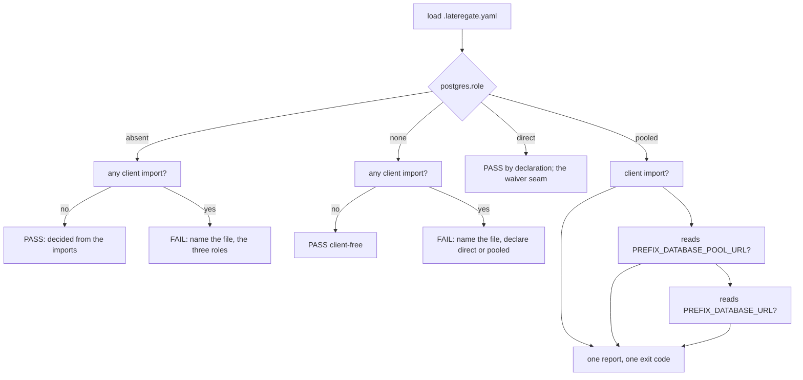

# Gate the Postgres role every repository declares

## The problem

One managed Postgres serves the family: thirteen databases, fourteen
deployments, about 22 usable connection slots. Every service claims its
share by opening a direct connection per pool entry and one more for its
migrations at boot, and on 2026-09-16 that arrangement refused work four
times in one evening with SQLSTATE 53300.

The family's fix, recorded in latere-ai/specs as
`infrastructure/database-pooling.md`, is a transaction-mode pooler per
service: serving traffic reaches the database through the pool, migrations
stay on the direct endpoint because they hold a session-scoped advisory
lock, and the pool sizes are a budget that must sum under the cap. The
code change per service is small. Read `DATABASE_POOL_URL` when set and
fall back to `DATABASE_URL`; keep handing `DATABASE_URL` to the migrator.

Small changes across eleven repositories over weeks are exactly the shape
that drifts. A repository that never reads the pooled name keeps working
on the direct endpoint, silently claiming slots the budget gave to
somebody else, and nothing today notices. A new service can ship direct
by accident. The rule holds only if something runs it on every push, and
the family's build order puts that first: the gate lands before any
service moves, so each cutover is a repository made to pass a rule the
family already runs.

## The gate

`postgres` is a gate every repository runs, driven by a block in
`.lateregate.yaml` that names the repository's relationship to the shared
database. It has the shape of [[019-identity-gate]]: a role per
repository, static rules per role, every failure a reason and the fix. It
shares no code with that gate, only the shape, so it depends on it here in
form and not in the frontmatter.

```yaml
postgres:
  role: pooled        # none | direct | pooled
  prefix: EVAL        # optional: the names are <PREFIX>_DATABASE_POOL_URL and <PREFIX>_DATABASE_URL
```

### What a Postgres client is

A non-test Go file imports a Postgres client when its import list holds
any of:

| Import | Why it counts |
|---|---|
| `github.com/jackc/pgx`, any major version, any subpackage | the driver and pool the family connects with |
| `github.com/lib/pq` | the other driver, used by golang-migrate's `postgres://` scheme |
| `github.com/golang-migrate/migrate/v4/database/postgres`, `.../database/pgx`, any version | a migrator that opens a Postgres connection of its own |
| `latere.ai/x/pkg/pgxmigrate` | the family's migration runner, which opens the database it is handed |

`database/sql` alone is not a Postgres client; it is generic. The driver
it is opened with is, and the driver's import line is the finding.

Test files, `testdata/`, `node_modules/`, `.git/` and `.claude/` are not
read, as in every scan of this tool. A tree is walked once.

### What an environment read is

The `pooled` role asks whether the source reads two environment names.
The family reads a DSN in three shapes, found by survey on 2026-09-19:

| Shape | Where it is used |
|---|---|
| `os.Getenv("DATABASE_URL")`, `os.LookupEnv(...)` | auth, lectio, replichai, sandboxd (as a flag default) |
| a local helper, `getenv("PLATFORM_DATABASE_URL")` | platform, topos |
| a struct tag `env:"DATABASE_URL,required"` (caarlos0/env) | auth, drive, aaai-web |

So a read of the name `N` is any of:

1. a call whose callee's last identifier contains `env`, case
   insensitive (`Getenv`, `LookupEnv`, `getenv`, `envOr`, `mustEnv`),
   with `N` as a string literal argument, or as an identifier argument
   that a `const` or `var` in the same package binds to the literal `N`;
2. a struct field tag whose `env` key's first comma-separated element is
   `N`.

A name in a comment, a log line, or an error message is not a read.
Nothing is type-checked: this is the depth the identity gate works at,
and the depth every other static gate here works at.

### The roles

| Role | Meaning | What runs | What fails |
|---|---|---|---|
| `none` | the repository holds no Postgres client | `client-free` | any non-test Go file imports a client; the finding names the file and the line and says to declare `direct` or `pooled` |
| `direct` | the repository connects to the database directly | `direct` | nothing, in this release. The row prints that it passed by declaration. The family's build order step 4 makes this role require a dated waiver once the first ten cutovers land; the seam is the role's single check function, and the waiver shape is the one `identity.waive` and the top-level `waive` already carry |
| `pooled` | serving traffic reads the pooled DSN and falls back to the direct one; the migrator gets the direct one | `client`, `pool-url`, `direct-url` | no client import (a pooled repository without a client is a misdeclaration); nothing reads `<PREFIX>_DATABASE_POOL_URL`; nothing reads `<PREFIX>_DATABASE_URL` |
| absent | undeclared | `declared` | any client import. The finding names the file and the three roles. A tree with no client passes, and the report says the gate decided from the imports and that a declaration is the better shape |

`prefix` is optional and belongs to `pooled` only. Set anywhere else it
is a value nothing reads, and the load refuses it. It is uppercase
letters, digits and underscores, without the trailing underscore, so
`EVAL` yields `EVAL_DATABASE_POOL_URL` and `EVAL_DATABASE_URL`; the same
shape as `identity.config_prefix`. A repository whose DSN variable does
not end in `DATABASE_URL` (luxd's `LUX_DB_URL`, sandboxd's `CELLA_DB_URL`)
renames it in the release that flips its role to `pooled`, which is a
code change already, and the family's document names luxd's rename as
work outside its own leaf.

Every check prints `PASS`, `FAIL` or `SKIP` with a note, and a check with
nothing to read says so rather than passing: a `pooled` tree with no Go
file at all reports `SKIP` on every check and fails the gate, because a
role that runs no check has held nothing.



### What it does not check

- That the pooled DSN reaches the pool and the direct DSN reaches the
  migrator. That is dataflow through the function that opens the store,
  and a static rule over it would guess. The family's document leaves it
  to review, and the per-service load pass in its acceptance A5 is what
  catches a miss.
- That two statements sit in one transaction, or that no session-scoped
  lock runs on the pooled connection. Review items, named as such by the
  family's document.
- That the declared role is right. `direct` is a declaration this release
  accepts; a repository that connects directly and declares `none` is
  caught by the import scan, and one that declares `pooled` without
  reading the names is caught by the read scan, but a repository that
  reads both names and hands the wrong one to the wrong client passes.
- Deploy manifests and Secrets. The gate reads Go source. Which key a
  Secret carries is terraform's, and step 2 of the family's order.

### Wiring

The gate joins `bar.Gates` after `identity`, with no `Applies`: like the
identity gate, it decides inside from the tree, and the absent-role path
is the applicability question answered with a report rather than a skip.
It therefore runs under `lateregate` with no arguments, appears in
`lateregate list -json`, and the shared workflow's matrix picks it up
without a change there.

`contract` prints the declared role in its in-shape line when the block
is present. It does not report an absent block as drift: the gate passes
an undeclared tree that holds no client by design, and a wiring report
that contradicts the gate would be two authorities. `init` writes no
decision, so it writes no block, as it writes no identity block.

This repository declares `role: none`. It is a tool, it holds no client,
and declaring is what puts `config.PostgresRole` under the enum gate
beside `config.Role`.

## Acceptance criteria

| Criterion | Test that proves it |
|---|---|
| A tree with no block and no client passes, and the report says the gate decided from the imports | `TestAbsentRoleDecidesFromTheImports` |
| A tree with no block and a client import fails, naming the file and the three roles | `TestAbsentRoleDecidesFromTheImports` |
| `none` passes a clean tree and fails a tree with a client import, naming the file and the roles to declare | `TestRoleNone` |
| `direct` passes and says it passed by declaration | `TestRoleDirectPassesByDeclaration`, retired in v0.45.0 when [[023-direct-needs-a-dated-waiver]] made the role need a live waiver |
| `pooled` passes a tree that imports a client and reads both names, in every shape the family uses: `os.Getenv`, a local helper, a struct tag, a same-package constant | `TestRolePooledReadsInEveryShape` |
| `pooled` fails a tree missing the pooled read, one missing the direct read, and one missing the client, and each failure names the missing thing | `TestRolePooledFails` |
| `pooled` with `prefix` checks the prefixed names and not the bare ones | `TestPrefixNamesTheVariables` |
| A `pooled` tree with no Go file fails with `SKIP` on every check | `TestNothingPassesVacuously` |
| A name in a comment, a log line or an error string is not a read | `TestAMentionIsNotARead` |
| The load refuses an unknown role, a `prefix` outside `pooled`, and a malformed `prefix` | `TestPostgresValidationRejects` in `internal/config` |
| The block's presence is recorded, and an empty block fails the load with the role list | `TestPostgresPresenceIsRecorded`, `TestPostgresValidationRejects` |
| The sentence of every finding, after its location, passes the `registers` gate's tells | `TestPostgresFindingsAreUserRegister` |
| The gate is in the plan, and `contract` prints the role when declared | `TestPlanNamesEveryGateInOrder` in `internal/bar`, `TestContractPrintsThePostgresRole` in `internal/contract` |
| Fixture repositories: none clean, none with pgx, direct, pooled complete, pooled missing the pool name, pooled missing pgx, absent with and without pgx | the named fixture trees in `internal/postgres/postgres_test.go`, written to a fresh root per test as the identity gate's are |

## Outcome

Shipped on 2026-09-19, unreleased at the time of writing: the `postgres`
block in `internal/config`, the gate in `internal/postgres`, the entry in
`bar.Gates` after `identity`, and the declared role in `contract`'s in-shape
line. `internal/postgres` measures 93.9% under the repository's own `cover`
gate; every criterion above has the test it names.

**Two corrections to the text above, made so the spec describes what
shipped.** The fixtures are named trees in the test file rather than a
`testdata/` directory, as the identity gate's are, because the scan skips
`testdata/` and the licence and format gates would otherwise read the
fixtures as this repository's source. `none` over a tree with no Go file
passes with its reason, where `pooled` over the same tree fails: the first
role claims nothing a file would have to show, the second claims two reads
and a client.

**Left to the family.** Every repository that connects to the shared
database declares `direct` in the release that bumps to this gate, which is
the rest of the family's step 1. Two repositories read a DSN under a name
that does not end in `DATABASE_URL`, luxd's `LUX_DB_URL` and sandboxd's
`CELLA_DB_URL`; each renames it in the release that flips its role to
`pooled`. The `direct` waiver is the family's step 4 and changes
`ruleDirect` alone.
