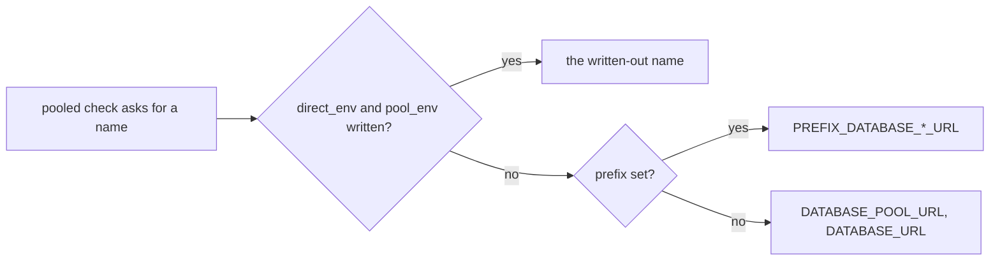

# The postgres gate takes the two names, it does not derive them

## The problem

[[021-postgres-gate]] shipped a `pooled` role that checks two environment
reads, and it decides which two names to look for from an optional
`prefix`. `prefix: EVAL` demands `EVAL_DATABASE_POOL_URL` and
`EVAL_DATABASE_URL`; no prefix demands the bare pair. A repository whose
variables are spelled any other way cannot satisfy the gate, so the spec
recorded a rename as work owed by two repositories: luxd would rename
`LUX_DB_URL`, sandboxd would rename `CELLA_DB_URL`.

That is the gate reaching into the wrong layer. Three facts, and the
derivation confuses them:

| Layer | Who owns it | Where it is written |
|---|---|---|
| The Secret key | the family | one key per endpoint in the family's terraform, the same for every service |
| The variable name | the service | the name the service's own configuration reads |
| The mapping between them | the Deployment | `env[].name` with `valueFrom.secretKeyRef.key` |

A Deployment maps any Secret key to any variable name, and does so
already. So a rename buys nothing: the same Secret key reaches the same
process under a different spelling, and the process reads the same two
endpoints either way. The rule the family actually wants is the one the
gate's own checks state: **the serving path reads a pooled endpoint and
falls back to a direct one, and the migrator receives the direct one.**
Spelling is not part of that sentence, and a gate that enforces spelling
fails a repository that satisfies the rule.

The cost is not theoretical. A rename of a configuration variable is a
breaking change for every installation of an open core, and the derivation
would have charged two cores that price for nothing.

## The design

`postgres` gains two keys under which a repository writes its two names
out:

```yaml
postgres:
  role: pooled
  direct_env: LUX_DB_URL
  pool_env: LUX_DB_POOL_URL
```

`Postgres.DirectURL()` and `Postgres.PoolURL()` are the single seam every
`pooled` check reads a name through, so the resolution order lives there
and the gate itself is unchanged:



### What the load refuses

| Rule | Why |
|---|---|
| `direct_env` and `pool_env` are declared together | the rule is a pair of endpoints; one name written out and one derived is two conventions in one block |
| neither may stand beside `prefix` | a prefix derives the pair and the keys write it out; two sources for one answer is a block with no single reading |
| each is shaped `^[A-Z][A-Z0-9_]*[A-Z0-9]$` | a value that is not an environment variable name would be searched for and never found, which is a gate that fails for a typo without saying so |
| both are meaningful under `pooled` alone | no other role reads a name, so the keys elsewhere are a decision with no effect, as `prefix` already is |
| the two differ | they name two endpoints; one name for both passes the gate having checked one endpoint twice |

### What does not change

Absent both keys, the gate behaves exactly as [[021-postgres-gate]]
shipped it: the bare pair, or the prefixed pair. Every repository already
pinned to this tool keeps passing without an edit, and no check function
in `internal/postgres` is touched.

### The rename that does not happen

[[021-postgres-gate]] closes by owing the family two renames, luxd's
`LUX_DB_URL` and sandboxd's `CELLA_DB_URL`, each in the release that flips
its role to `pooled`. Neither is owed any more. lux flips to `pooled` and
declares the names it already reads; the family's convention for an open
core with a database is `<PRODUCT>_DB_URL` and `<PRODUCT>_DB_POOL_URL`,
which is what lux reads today.

## Acceptance criteria

| Criterion | Test that proves it |
|---|---|
| The two names load and are what the pooled checks read | `TestPostgresTakesTheNamesWrittenOut` in `internal/config` |
| The written-out names are the ones checked; the bare pair does not satisfy them and they do not satisfy the bare check; a half-read tree fails at the written-out direct name | `TestWrittenOutNamesAreTheOnesChecked` in `internal/postgres` |
| One name without the other is refused, either way round | `TestPostgresValidationRejects`, cases `direct_env alone` and `pool_env alone` |
| The names beside a `prefix` are refused | the same test, case `names beside a prefix` |
| The names under `direct` and under `none` are refused | the same test, cases `names under direct` and `names under none` |
| A name that is not an environment variable name is refused, in either key | the same test, cases `lowercase name` and `name with a space` |
| One name for both endpoints is refused | the same test, case `one name for both endpoints` |
| The prefix path and the bare path are unchanged | `TestPrefixNamesTheVariables`, `TestRolePooledReadsInEveryShape`, `TestRolePooledFails`, all unedited |

## Outcome

Shipped in v0.44.0: `Postgres.DirectEnv` and `Postgres.PoolEnv` in
`internal/config`, resolved in `DirectURL()` and `PoolURL()` and held to
the five rules above by `validateNames`. `internal/postgres` is unchanged:
every check already read its names through those two methods.
`internal/config` measures 98.0% and `internal/postgres` 93.3% under this
repository's own `cover` gate, and the new code is at 100%.

lux is the first consumer: it declares `role: pooled` with
`direct_env: LUX_DB_URL` and `pool_env: LUX_DB_POOL_URL`, and passes all
three pooled checks without a line of Go changing.
