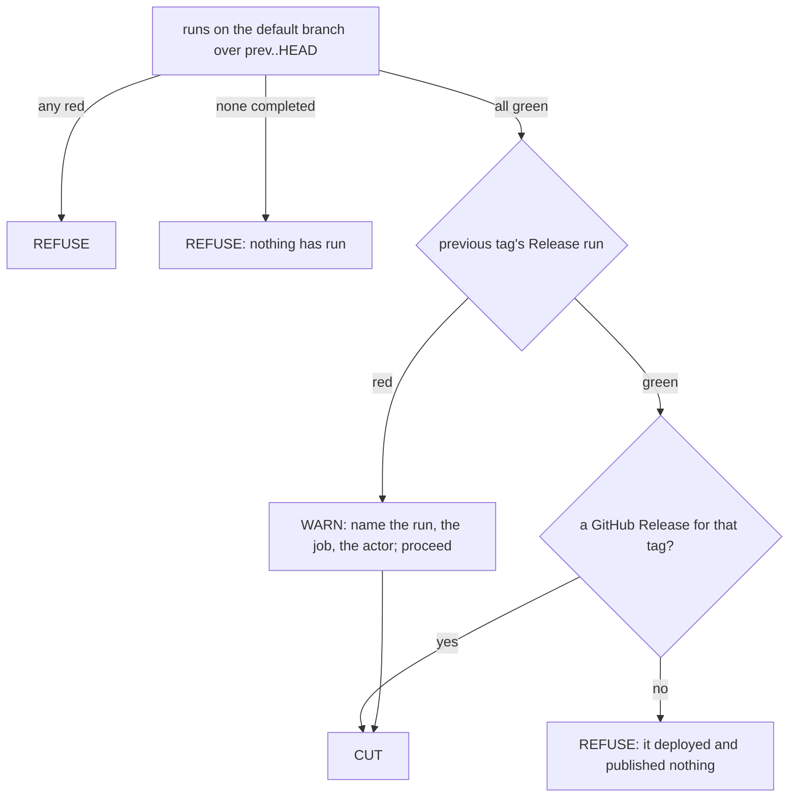

# A failed rollout is history, not a veto on the next cut

## The problem

[[020-green-before-cut]] gave the cut three reads. Every workflow with a
completed run on the default branch over `prev..HEAD` must be green; the
previous tag's Release run must be green; and a previous tag whose Release
run went green must have a GitHub Release to show for it.

The second of those is wrong, and it cost a day.

A Release run is not a test of the repository. It is a rollout: it builds an
image, deploys it, smokes the deployment and publishes the notes. When it
fails at `deploy` or at `smoke`, what failed is the previous tag reaching
production. The tree being tagged now is a different tree, and the tag being
cut is very often the repair.

Two instances, both real, both on 2026-09-19:

| Repository | Run | Failed at | What the veto did |
|---|---|---|---|
| `auth` v0.37.0 | [35458476040](https://github.com/latere-ai/auth/actions/runs/35458476040) | `release / deploy` | v0.37.1 carried the repair for the crash-loop; `ci`, `codeql` and `Docker` were green on both commits in the window; the cut was refused and went out under `-force-red` |
| `eval` v0.5.0 | [35344468893](https://github.com/latere-ai/eval/actions/runs/35344468893) | `release / smoke` | the deployment is held at `replicas: 0` by design, so the smoke against a live origin fails at every tag; the repository has been unreleasable since, and nobody overrode it |

The second row is the shape that matters. A veto on a rollout is not a
delay, it is a permanent block wherever the rollout fails for a standing
reason. The first row is the shape that costs trust: the escape hatch a
maintainer keeps for the case nobody foresaw became the ordinary way past a
bug everybody understood.

## The rule

What gates a cut is evidence about the commit being tagged, plus evidence
that the release machinery does what it claims.

Push-triggered workflows over the window stay hard vetoes. They ran on the
commits being tagged, which is what a cut is a statement about.

The previous tag's Release run becomes a warning. It is read exactly as
before, classified exactly as before, and printed in the same three lines a
refusal uses, ending with the `BUDGET`, `INFRA` or `CODE` line naming who
acts. What changes is the exit code.

The Release-that-published-nothing refusal keeps its scope: a Release run
that concluded `success`, and no GitHub Release for the tag. That case is a
discrepancy nobody can see. The workflow claimed to have finished and left
nothing behind, so the next tag claims the same and leaves the same, and
that is exactly the failure a machine should be watching for. A **red** run
that published nothing is that run's own visible consequence and carries no
information the red does not already carry, so it is not asked.

Keeping that refusal conditioned on a green run is what lets this change
reach the two cases above. Judging the Release workflow only by whether the
previous tag published, and dropping the conclusion entirely, refuses both
of them: in each, the publishing job was `skipped` because an earlier job
failed, so neither `auth` v0.37.0 nor `eval` v0.5.0 has a GitHub Release at
all.

### Why not split the Release run by job

The considered alternative was to keep the veto and distinguish which job
failed: `build` or `test` still blocks, `deploy` or `smoke` warns. It was
rejected for two reasons.

It is a heuristic over job names, which every repository writes for itself,
and a veto built on a name match is a veto that misfires the day somebody
renames a job.

More importantly it is not true. "The tag being cut is the repair" applies
to a failed image build exactly as it applies to a failed deploy, and a
broken image build is caught where it belongs: by the `Docker` workflow on
the commits being tagged, which is rule one. Every part of a previous
rollout's failure is either redundant with the window rule or is history.
The uniform rule is the honest one.

## Acceptance criteria

| Criterion | Test that proves it |
|---|---|
| A previous tag whose Release run failed at `deploy` does not refuse the cut, and the warning names the run, the failing job, the URL and the actor | `TestAFailedRolloutIsReportedAndNotRefusedOn` |
| A previous tag whose Release run failed at `smoke` does not refuse the cut | `TestASmokeThatFailsAtEveryTagDoesNotWedgeTheRepository` |
| A red Release run is not asked whether it published, so one fact does not become two refusals | `TestARedRolloutIsNotAskedWhetherItPublished` |
| A failed rollout does not excuse a red run over the window; the warning prints beside the refusal | `TestAFailedRolloutDoesNotExcuseARedWindow` |
| A green Release run with no GitHub Release still refuses | `TestAPreviousTagThatPublishedNothing` |
| A green window, a green rollout and a published previous tag still cut in silence | `TestGreenCutProceeds` |
| Nothing passes vacuously: a window with no completed run still refuses | `TestNothingHasRunYet` |
| `-force-red` prints the warning once and then what it overrides | `TestForceRedPrintsTheRolloutWarningOnce` |

## Outcome

Shipped in v0.46.0. `report` carries `warnings` beside `findings` and
`Check` prints them before it decides, so a report with warnings alone exits
zero. `scan`'s red-rollout branch fills `warnings`; the published check is
untouched and still runs only under `success`.

Verified against the two runs in the table. `auth`: both commits in
`v0.37.0..v0.37.1` carry green `ci`, `codeql` and `Docker` runs, so under
this rule v0.37.1 cuts with no override. `eval`: `CI` is green on HEAD and on
every commit since v0.5.0, so it cuts today, for the first time in two
versions.
