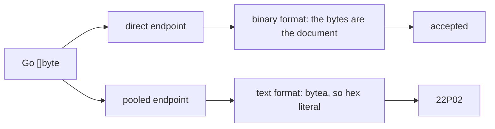

# A json parameter is not bytes, and the pooled endpoint is where that shows

## The failure

`auth` v0.37.0 shipped on 2026-09-19, deployed, and crash-looped at
start-up. Every test had passed, the image built, and the previous version
on the same code path had run for weeks.

The serving DSN carries `default_query_exec_mode=exec`. It has to: a
transaction pooler hands a different backend to the next transaction, so
pgx cannot keep a prepared statement on the server and exec mode is how it
stops trying.

Exec mode also decides the wire format. With no prepared statement there is
no parameter OID from the server, so pgx infers the wire type from the Go
type and sends every parameter in the **text** format. A Go `[]byte` is a
`bytea`, and a `bytea` in the text format is the hex literal
`\x7b226b223a2276227d`. A hex literal is not a json document, so the server
refuses it:

```
ERROR: invalid input syntax for type json (SQLSTATE 22P02)
```

Under the binary format the same bytes arrive as the json text they are and
the statement succeeds. That asymmetry is the whole difficulty:



A test on a direct connection cannot see it. A test on the pooled DSN can,
which is the repair `auth` shipped beside the fix, but the repository that
has not been pooled yet carries the fault silently and starts crash-looping
on the day somebody flips its role. That makes it a static rule's job and
not a test's.

A hand audit of `agents` after the `auth` outage found nine more of the same
bind. Nothing found them but a person reading every statement.

The repair is to bind a `string`, or a `*string` where a nil has to stay
SQL NULL rather than become an empty document.

## What must not be flagged

A `[]byte` bound to a `bytea` column is correct and the family has many:
encrypted blobs in `auth`'s key store, the service-account ciphertext in
`agents`, gob-encoded session state in `auth`'s token store. A rule that
flagged those would be waived within a week, and a waived rule checks
nothing. Precision is the requirement here, not recall.

## What the wire format decides, measured

The first shipping of this rule was reasoned rather than measured, and was
wrong twice: it reported `json.RawMessage`, which pgx holds a codec for and
which never fails, and it passed a Go struct, which fails harder than a byte
slice. The table below is the measurement the rule now follows. Postgres 17,
pgx v5.9.2, `default_query_exec_mode=exec`, each Go value bound to one
parameter of a `json` column, a nullable `jsonb` column, a `NOT NULL jsonb`
column and a `$1::jsonb` cast.

| Bound value | json parameter | Why |
|---|---|---|
| `[]byte` | 22P02 | sent as bytea, arrives as a hex literal |
| a named byte slice, not from a json package | 22P02 | the same |
| `json.RawMessage` | accepted | pgx registers it to the json type |
| `*json.RawMessage` | accepted | the pointer is dereferenced first |
| `string`, `*string` | accepted | sent as unadorned text |
| a named string type | accepted | the underlying type is found |
| a value with a `String() string` | accepted | the stringer wrapper |
| a value with a `Value() (driver.Value, error)` | accepted | the database value fallback |
| a pgx text value | accepted | its text method is read before anything else |
| untyped `nil` | accepted | SQL NULL |
| a number | accepted | a number is a json document |
| `bool` | 22P02 | sent as `t`, which is not json |
| `[]string` | 22P02 | sent as `{a,b}`, which is not json |
| `time.Time` | 22P02 | registered to timestamptz, so its stringer is never asked |
| a struct, a pointer to one, a map | `cannot find encode plan` | in none of the registered set, the wrappers or the fallback |
| a list of a repository's own named type | `cannot find encode plan` | a list is registered beside pgx's own types only |

Two rows are the server's and not the driver's, and neither is visible to a
static rule: a nil into a `NOT NULL` column is 23502, which needs the schema,
and an empty `string` into a json column is 22P02, which needs the value.

The last two rows are a second failure, and a different one. The driver's
plan lookup takes the Go type and an undescribed parameter, and never the
column, so a Go struct fails the same way against a json column, a text
column and a cast, and fails in the driver before the statement is sent. An
endpoint that describes the statement first accepts every row of the table,
which is why the direct endpoint and a `cache_describe` DSN hide both
failures and the pooled endpoint in exec mode hides neither.

## The signal

`json-bytes` reports two things, from one pass over the statements.

The first is a value a json parameter will not take. The second is a value
the driver holds no encoding for, which no parameter will take.

A call is a statement when its name starts with `Exec` or `Query`, or is
`Queue`, **and** its signature takes the SQL as a `string` immediately
followed by a variadic empty interface. The name narrows; the signature
decides. That is the shape of every pgx entry point, of `pgxpool`, of
`pgx.Tx` and `pgx.Conn`, of the batch member, and of the family's wrappers
over them. Nothing matches an import path, so a repository's own `Querier`
interface is read as what it is, which is how `auth`'s
`principal_keys.go` bind was found.

The parameters begin at the variadic position, so argument *i* is `$(i+1)`
and every finding names the parameter. A call that spreads a slice,
`Exec(ctx, sql, args...)`, hands over something with no positions to read
and is skipped.

A parameter is json when either holds:

| Evidence | Where it comes from |
|---|---|
| the statement casts it, `$6::jsonb` or `CAST($6 AS json)` | the SQL literal, resolved through `go/types` so a named constant is read too |
| the value is a json encoding | a type-aware pass over the package |

A value is a json encoding when it is a result of `json.Marshal` or
`MarshalIndent`, of any `MarshalJSON`, of the same functions in the family's
alternative encoders; or when its type is a named byte slice from a json
package, which is `json.RawMessage`. That last one is an alias for
`jsontext.Value` from Go 1.26 on, so both the name written and the type it
resolves to are recognised.

On a json parameter the rule names what is **accepted** rather than what is
refused, so a shape nobody measured is reported rather than let through. The
accepted set is the accepted rows of the table: a string under any name, a
pointer to one, a named byte slice from a json package, a value that hands the
driver a text or a database value of its own, a number, and an untyped nil.
Everything else is reported, `[]byte` among it.

The order the rule asks these questions in is the driver's own: a text method
first, then the driver's registered set, then the wrappers that find a
stringer behind an unknown type. A clock reading is what that order decides.
It has a string method and is never asked for it, because the driver holds a
column type for it and writes a timestamp that json refuses.

Three carriers propagate the json flag, and all three were needed:

1. A conversion. `[]byte(receipt)` is still a json encoding and is still
   bytes; `string(receipt)` is still a json encoding and is the repair, so it
   says the parameter is json and passes as the carrier.
2. A local variable, including one declared as an interface. `agents` wrote
   `var payload any` and assigned `[]byte(ev.Payload)` on one branch; the
   declared type says nothing, so the assignment is what is read. What a
   variable can hold grows and never shrinks, because a value that reaches
   the statement on any branch reaches it.
3. A function of the module, summarised per result. `agents` wrapped the
   encoder in `marshalJSON` and bound its result six times; `auth` assigned
   the encoder to a named result in `columns()` and returned it. Without the
   summary all of those are invisible at the call. The summaries settle by
   iteration, bounded at three passes.

A summary carries the concrete types a result can have as well as whether it
is json, which is what reads a helper whose declared result is `any`.
`llm-gateway` bound `NullableJSON(...) any` six times from six packages, and
the declared type says nothing about the raw message or the nil behind it.
The summaries are keyed by name across the whole module rather than by
pointer inside one package, so a helper one import away is read the same as
one next to the statement. A value whose concrete type no summary and no
assignment names is reported as nothing at all: reporting every empty
interface would report most of the family, and a check that is mostly noise
is waived and then guards nothing.

A parameter the statement casts to something that is **not** json is never
reported **as a carrier**, whatever the value is: `$3::bytea` says the column
takes bytes and bytes are what it should get. The second rule is not
suppressed by any cast, because the driver's plan lookup does not read one.

### The second signal: no encoding at all

A value the driver holds no encoding for is reported at any parameter, with
no json evidence needed, because there is nothing about the column to be
evidence of. That is a Go struct, a Go map, and a list or an array of a type
the driver does not hold.

What the driver does hold, and what is therefore never reported: a builtin
under any name, a byte slice, a named type from `time`, `net`, `net/netip` or
pgx's own `pgtype`, anything with a text method, a stringer or a database
value method, and a list of one of those. Reading pgx's registered set by
package rather than by copying forty type names is deliberate: the list moves
between releases, and a name this rule failed to copy across would be
reported as unencodable although it encodes.

This is the signal that reaches `platform`'s three binds, where `payload :=
row` put a struct into a jsonb column under a statement that says nothing
about json and a value with no json provenance. Nothing that is json-gated
can see those without a parser for the repository's migrations, and the
column list of one of the statements next door is `VALUES (`+`recordColumns`+`)`,
which no such parser would read.

### Why the stated signal was not enough

The rule this started from was "the SQL text mentions json or jsonb and a
bound argument is `[]byte`". It finds `auth`'s two registry columns, which
carry `$6::jsonb` and `$11::jsonb`, and **none** of `agents`' nine. Not one
of the `agents` statements says json:

```sql
INSERT INTO agents (id, org_id, ..., runtime_config, ..., budget, metadata, ...)
VALUES ($1,$2,...,$15)
UPDATE sessions SET lift_receipt = $2, updated_at = $3 WHERE id = $1
```

The column is jsonb; the statement never says so, because it does not have
to. Provenance is what carries those, and the cast is what carries a value
whose provenance is out of reach.

### What it runs on

The type-aware pass costs a type-check of the module, so it runs only where
there is something to read: the syntactic scan asks whether any file calls
something statement-shaped, and a tree with none passes with that as its
reason. A tree that does have statements and does not type-check is an
error naming what failed, because a package this pass could not read is a
package the bug can sit in unseen.

The row is in every role, the absent one included, for the reason in the
first section: the role a repository declares says nothing about whether it
carries the fault.

### Known boundaries

- One module. A helper outside it, or one whose package this pass read from
  export data rather than from source, is not followed.
- A value whose concrete type is out of reach is reported as nothing. An
  empty interface filled by a caller is the common case.
- A statement built at run time has no text, so only the value's provenance
  decides it.
- `Exec(ctx, sql, args...)` is skipped.
- A json encoding deliberately written to a `bytea` column, with no cast in
  the statement to say so, is reported. No instance exists in the family;
  the parameter cast is the way to say it on purpose.
- A nil into a `NOT NULL` column is 23502 and an empty `string` into a json
  column is 22P02, and this rule sees neither. The first needs the schema and
  the second needs the value. A string is the repair for the encoding and is
  not a claim that every string is a document.
- A value the driver would find through a `driver.Valuer` that returns bytes
  rather than text is accepted here, because the return is not visible at the
  bind. The measurement used a valuer that returns text, which is what
  `uuid.UUID` and the family's own identifier types do.
- A list of lists beyond `[][]byte` is read as encodable and is not. No
  instance exists in the family.
- Nothing in the family registers a type on a pgx type map at run time, which
  a sweep for `RegisterType` and `RegisterDefaultPgType` across every Go
  repository confirms. A repository that starts doing so would have the
  registered type reported as unencodable.

## Acceptance criteria

| Criterion | Test that proves it |
|---|---|
| Every row of the measured table is the check's answer, accepted and refused alike | `TestWhatAJSONParameterTakes` |
| A Go struct bound to a parameter no statement calls json is caught | `TestAGoStructIsNotEncodable` |
| A Go map is caught, and a list of a repository's own named type is caught | `TestAGoMapIsNotEncodable`, `TestAListOfANamedTypeIsNotEncodable` |
| What the driver holds an encoding for passes, whatever Go shape carries it | `TestWhatTheDriverEncodesPasses` |
| A helper whose declared result is `any` is read, in this package and one import away | `TestAHelperThatHandsBackAnEmptyInterfaceIsFollowed`, `TestAHelperInAnotherPackageIsFollowed` |
| A helper whose every path a json parameter takes passes | `TestAHelperWhoseEveryPathIsAcceptedPasses` |
| A value whose concrete type is out of reach is not reported | `TestAValueOutOfReachIsNotReported` |
| What the schema decides is not this check's to decide | `TestWhatTheSchemaDecidesIsNotThisCheck` |
| A byte slice into a jsonb cast is caught, and the finding names the file, the line and the parameter | `TestAByteSliceIntoAJsonbCastIsCaught` |
| A string and a pointer to string into the same cast pass | `TestAStringIntoAJsonbCastPasses` |
| A byte slice into a bytea column passes, cast or not | `TestAByteSliceIntoByteaPasses` |
| A json encoding bound inline is caught although the statement says no json | `TestAnInlineMarshalIsCaught` |
| A statement with no json and no encoding is not reported | `TestNoJsonIsIgnored` |
| A helper returning the encoder's result is followed | `TestAHelperThatReturnsAnEncodingIsFollowed` |
| A named result carrying the encoder's output is followed | `TestANamedResultCarriesTheEncoding` |
| A raw message converted to bytes is caught, and the string conversion repair passes | `TestARawMessageConvertedToBytesIsCaught`, `TestTheStringConversionRepairPasses` |
| A value reaching the statement through an interface-typed local is caught | `TestAnEncodingReachingTheStatementThroughAnInterfaceIsCaught` |
| A function named Query that is not a statement, and a spread parameter list, are not read | `TestWhatIsNotAStatement` |
| The row runs under the absent, none and direct roles | `TestJSONBytesRunsUnderEveryRole` |
| A tree with statements that does not type-check is an error | `TestATreeThatDoesNotTypeCheckIsAnError` |
| A tree with no statement is not type-checked, and says so | `TestATreeWithNoStatementIsNotTypeChecked` |
| Both cast spellings are read, and the first cast of a parameter wins | `TestParameterCasts` |
| The finding's sentence passes the `registers` gate's tells | `TestPostgresFindingsAreUserRegister` |

## Outcome

Shipped in v0.46.0 as `internal/postgres/jsonbytes.go`.

Verified against the commits the failure is recorded in.

| Tree | Reported |
|---|---|
| `auth` at `6a3d142`, the commit that deployed | 10, the four registry binds among them: `redirect_uris` and `allowed_origins` on both the insert and the update |
| `auth` at `3b4575b`, the repair | 6; the four registry binds are gone |
| `agents` at `22543e5^` | 9, which is what the repair's own commit message counts: six agent columns and three session columns |
| `agents` at `origin/main` | none |

The legitimate `bytea` binds stayed quiet in both: `auth`'s gob-encoded
`session_data` beside a reported `form_data` in the same statement, and
`agents`' service-account ciphertext.

A sweep of the twenty-six Go repositories in the workspace type-checked
every one, with no load failure anywhere. Read at each repository's
`origin/main`, it reports 53 binds across twelve of them: `arca` 1, `auth`
6, `drive` 6, `eval` 1, `insula` 1, `llm-gateway` 9, `lux` 4, `pay` 2,
`platform` 9, `replichai` 10, `sandbox` 3, `wallfacer` 1.

The six in `auth` are live: `redirect_uris` and `allowed_origins` on the
admin create path, `redirect_uris` on both dynamic-registration paths,
`form_data` on the token store, and `grants` on the personal-key insert,
every one of them a JSONB column on a repository already serving through
the pool. Sampled columns elsewhere are JSONB too: `arca`'s `events.detail`
and `lux`'s `objects.status`.

### Repaired in v0.47.0

Using it across the fleet found three defects in the rule above, and the
measured table replaced the reasoning that produced them.

`json.RawMessage` was reported and never fails: pgx registers it to the json
type. Seven of `llm-gateway`'s nine findings and one of `insula`'s were that,
and a check that is mostly noise is waived and then guards nothing.

A Go struct was passed and fails harder than a byte slice. `platform` had
three, and nobody knew how many the fleet had, because the check could not
see them.

A value laundered through a helper whose declared result is `any` was
invisible. `llm-gateway` had six behind `NullableJSON`, one import away from
every statement that bound them.

Proved at the two commits where the answer was already known:

| Tree | Before | After |
|---|---|---|
| `llm-gateway` at `9a46436^` | 9 | 2, the two `json.Marshal` results; the seven raw messages gone |
| `platform` at `3873ff9^` | 9 | 12, the nine kept and the three struct binds in `internal/lux/event_postgres.go` added |

Swept across every Go repository in the workspace at `origin/main`, with no
load failure anywhere: 9 before, 19 after. One finding left, `insula`'s raw
message. Eleven arrived, every one of them a value the driver holds no
encoding for: a `map[string]string` bound to a labels column in `cella` three
times and in `lux` three times, a list of a named identifier type in `arca`
and in `insula`, and the rest of `lux`'s object labels. Nothing else moved.

The legitimate `bytea` binds stayed quiet, and so did the clock readings, the
identifier types with a text method of their own, and the `[]string` bound to
a `text[]` column that sit beside every one of those statements.
