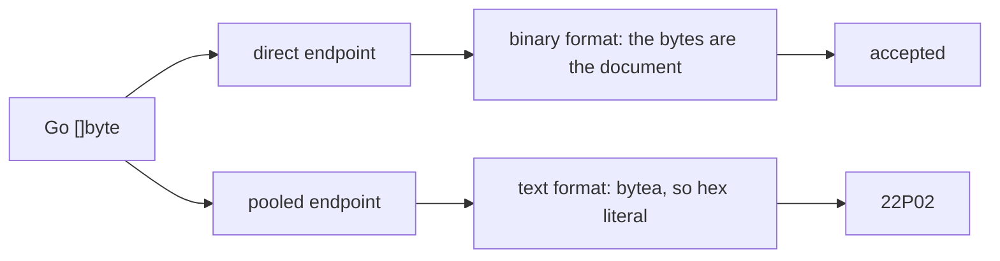

# A json parameter is not bytes, and the pooled endpoint is where that shows

## The failure

`auth` v0.37.0 shipped on 2026-09-19, deployed, and crash-looped at
start-up. Every test had passed, the image built, and the previous version
on the same code path had run for weeks.

The serving DSN carries `default_query_exec_mode=exec`. It has to: a
transaction pooler hands a different backend to the next transaction, so
pgx cannot keep a prepared statement on the server and exec mode is how it
stops trying.

Exec mode also decides the wire format. With no prepared statement there is
no parameter OID from the server, so pgx infers the wire type from the Go
type and sends every parameter in the **text** format. A Go `[]byte` is a
`bytea`, and a `bytea` in the text format is the hex literal
`\x7b226b223a2276227d`. A hex literal is not a json document, so the server
refuses it:

```
ERROR: invalid input syntax for type json (SQLSTATE 22P02)
```

Under the binary format the same bytes arrive as the json text they are and
the statement succeeds. That asymmetry is the whole difficulty:



A test on a direct connection cannot see it. A test on the pooled DSN can,
which is the repair `auth` shipped beside the fix, but the repository that
has not been pooled yet carries the fault silently and starts crash-looping
on the day somebody flips its role. That makes it a static rule's job and
not a test's.

A hand audit of `agents` after the `auth` outage found nine more of the same
bind. Nothing found them but a person reading every statement.

The repair is to bind a `string`, or a `*string` where a nil has to stay
SQL NULL rather than become an empty document.

## What must not be flagged

A `[]byte` bound to a `bytea` column is correct and the family has many:
encrypted blobs in `auth`'s key store, the service-account ciphertext in
`agents`, gob-encoded session state in `auth`'s token store. A rule that
flagged those would be waived within a week, and a waived rule checks
nothing. Precision is the requirement here, not recall.

## The signal

`json-bytes` reports an argument to a statement where the value is bytes
**and** the parameter is json.

A call is a statement when its name starts with `Exec` or `Query`, or is
`Queue`, **and** its signature takes the SQL as a `string` immediately
followed by a variadic empty interface. The name narrows; the signature
decides. That is the shape of every pgx entry point, of `pgxpool`, of
`pgx.Tx` and `pgx.Conn`, of the batch member, and of the family's wrappers
over them. Nothing matches an import path, so a repository's own `Querier`
interface is read as what it is, which is how `auth`'s
`principal_keys.go` bind was found.

The parameters begin at the variadic position, so argument *i* is `$(i+1)`
and every finding names the parameter. A call that spreads a slice,
`Exec(ctx, sql, args...)`, hands over something with no positions to read
and is skipped.

A parameter is json when either holds:

| Evidence | Where it comes from |
|---|---|
| the statement casts it, `$6::jsonb` or `CAST($6 AS json)` | the SQL literal, resolved through `go/types` so a named constant is read too |
| the value is a json encoding | a type-aware pass over the package |

A value is a json encoding when it is a result of `json.Marshal` or
`MarshalIndent`, of any `MarshalJSON`, of the same functions in the family's
alternative encoders; or when its type is a named byte slice from a json
package, which is `json.RawMessage`. That last one is an alias for
`jsontext.Value` from Go 1.26 on, so both the name written and the type it
resolves to are recognised.

Three carriers propagate it, and all three were needed:

1. A conversion. `[]byte(receipt)` is still a json encoding; `string(receipt)`
   is the repair and is not bytes, so it is not reported.
2. A local variable, including one declared as an interface. `agents` wrote
   `var payload any` and assigned `[]byte(ev.Payload)` on one branch; the
   declared type says nothing, so the assignment is what is read. The taint
   grows and never shrinks, because a value that reaches the statement on
   any branch reaches it.
3. A function of the same package, summarised per result. `agents` wrapped
   the encoder in `marshalJSON` and bound its result six times; `auth`
   assigned the encoder to a named result in `columns()` and returned it.
   Without the summary all of those are invisible at the call. The
   summaries settle by iteration, bounded at three passes.

A parameter the statement casts to something that is **not** json is never
reported, whatever the value is: `$3::bytea` says the column takes bytes and
bytes are what it should get.

### Why the stated signal was not enough

The rule this started from was "the SQL text mentions json or jsonb and a
bound argument is `[]byte`". It finds `auth`'s two registry columns, which
carry `$6::jsonb` and `$11::jsonb`, and **none** of `agents`' nine. Not one
of the `agents` statements says json:

```sql
INSERT INTO agents (id, org_id, ..., runtime_config, ..., budget, metadata, ...)
VALUES ($1,$2,...,$15)
UPDATE sessions SET lift_receipt = $2, updated_at = $3 WHERE id = $1
```

The column is jsonb; the statement never says so, because it does not have
to. Provenance is what carries those, and the cast is what carries a value
whose provenance is out of reach.

### What it runs on

The type-aware pass costs a type-check of the module, so it runs only where
there is something to read: the syntactic scan asks whether any file calls
something statement-shaped, and a tree with none passes with that as its
reason. A tree that does have statements and does not type-check is an
error naming what failed, because a package this pass could not read is a
package the bug can sit in unseen.

The row is in every role, the absent one included, for the reason in the
first section: the role a repository declares says nothing about whether it
carries the fault.

### Known boundaries

- One package at a time. A helper in another package that returns a json
  encoding is not followed.
- A statement built at run time has no text, so only the value's provenance
  decides it.
- `Exec(ctx, sql, args...)` is skipped.
- A json encoding deliberately written to a `bytea` column, with no cast in
  the statement to say so, is reported. No instance exists in the family;
  the parameter cast is the way to say it on purpose.

## Acceptance criteria

| Criterion | Test that proves it |
|---|---|
| A byte slice into a jsonb cast is caught, and the finding names the file, the line and the parameter | `TestAByteSliceIntoAJsonbCastIsCaught` |
| A string and a pointer to string into the same cast pass | `TestAStringIntoAJsonbCastPasses` |
| A byte slice into a bytea column passes, cast or not | `TestAByteSliceIntoByteaPasses` |
| A json encoding bound inline is caught although the statement says no json | `TestAnInlineMarshalIsCaught` |
| A statement with no json and no encoding is not reported | `TestNoJsonIsIgnored` |
| A helper returning the encoder's result is followed | `TestAHelperThatReturnsAnEncodingIsFollowed` |
| A named result carrying the encoder's output is followed | `TestANamedResultCarriesTheEncoding` |
| A raw message converted to bytes is caught, and the string conversion repair passes | `TestARawMessageConvertedToBytesIsCaught`, `TestTheStringConversionRepairPasses` |
| A value reaching the statement through an interface-typed local is caught | `TestAnEncodingReachingTheStatementThroughAnInterfaceIsCaught` |
| A function named Query that is not a statement, and a spread parameter list, are not read | `TestWhatIsNotAStatement` |
| The row runs under the absent, none and direct roles | `TestJSONBytesRunsUnderEveryRole` |
| A tree with statements that does not type-check is an error | `TestATreeThatDoesNotTypeCheckIsAnError` |
| A tree with no statement is not type-checked, and says so | `TestATreeWithNoStatementIsNotTypeChecked` |
| Both cast spellings are read, and the first cast of a parameter wins | `TestParameterCasts` |
| The finding's sentence passes the `registers` gate's tells | `TestPostgresFindingsAreUserRegister` |

## Outcome

Shipped in v0.46.0 as `internal/postgres/jsonbytes.go`.

Verified against the commits the failure is recorded in.

| Tree | Reported |
|---|---|
| `auth` at `6a3d142`, the commit that deployed | 10, the four registry binds among them: `redirect_uris` and `allowed_origins` on both the insert and the update |
| `auth` at `3b4575b`, the repair | 6; the four registry binds are gone |
| `agents` at `22543e5^` | 9, which is what the repair's own commit message counts: six agent columns and three session columns |
| `agents` at `origin/main` | none |

The legitimate `bytea` binds stayed quiet in both: `auth`'s gob-encoded
`session_data` beside a reported `form_data` in the same statement, and
`agents`' service-account ciphertext.

A sweep of the twenty-six Go repositories in the workspace type-checked
every one, with no load failure anywhere. Read at each repository's
`origin/main`, it reports 53 binds across twelve of them: `arca` 1, `auth`
6, `drive` 6, `eval` 1, `insula` 1, `llm-gateway` 9, `lux` 4, `pay` 2,
`platform` 9, `replichai` 10, `sandbox` 3, `wallfacer` 1.

The six in `auth` are live: `redirect_uris` and `allowed_origins` on the
admin create path, `redirect_uris` on both dynamic-registration paths,
`form_data` on the token store, and `grants` on the personal-key insert,
every one of them a JSONB column on a repository already serving through
the pool. Sampled columns elsewhere are JSONB too: `arca`'s `events.detail`
and `lux`'s `objects.status`.
